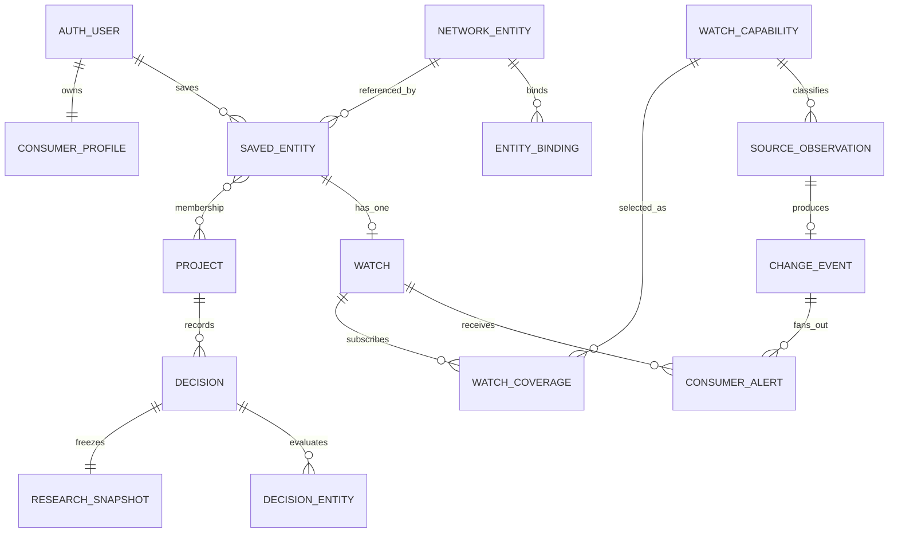
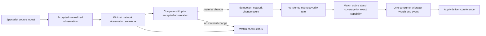

# My TrustHub production architecture contract

**Phase:** 2 / Prompt 10

**Status:** Complete for architecture review; no production implementation or migration

**Date:** September 7, 2026

**UX source:** Consumer Experience Lab, Prompts 1–9

> **Prompt 11 audit correction — September 7, 2026:** The live Supabase topology does not support the assumption that Move, Insurance, and Lender currently share one Auth tenant. They are separate projects in different regions; Move and Insurance contain at least one matching email identity with different `auth.users.id` values. No production schema may be created on the earlier assumed shared tenant. The existing empty `Conumers-Trust-Hub` Supabase project in `us-east-1` is the recommended dedicated parent control-plane candidate, subject to explicit identity-migration approval and verification of its live Auth redirect/provider, PITR, network, and operational settings. See `docs/my-trusthub-control-plane.md`.

## 1. UX FREEZE

Production must preserve these contracts. A later implementation may change transport, storage, or component internals, but it may not change these behaviors without reopening UX review.

1. My TrustHub is the private consumer workspace.
2. Project / Life Event is the primary organization model.
3. Save and Watch are separate actions. Save preserves research; Watch explicitly enables supported checks.
4. A Saved entity can belong to multiple Projects.
5. One Watch belongs to one user’s Saved entity, not to a Project.
6. Watch coverage is explicit, versioned, source-specific, jurisdiction-specific, and grain-specific.
7. Project membership never duplicates or implicitly changes a Watch.
8. Alert severity describes an event, never a company.
9. Source effective/official-as-of time, source publication time, retrieval time, observation time, and UI generation time remain distinct.
10. Saved research survives Project completion and archive.
11. Watches may continue after Project completion or archive and stop only by an explicit Watch action.
12. Decision records, selections, and notes are private consumer context and are not endorsements.
13. Specialist hubs remain the deep research environments.
14. My TrustHub owns memory, organization, resume, monitoring, and account controls.
15. Consumer Saves, Watches, selections, and private activity never influence public ranking or listing order.
16. Business Manager remains a separately authorized workspace even if it shares one sign-in identity.
17. Anonymous research and tools remain usable without an account or Project.
18. Guest import is item-level, explicit, consent-based, and deduplicated.
19. Saving, Watching, or selecting a provider creates no recommendation, certification, or endorsement.
20. Public/regulatory evidence and private consumer annotations remain in separate schemas, APIs, and authorization paths.
21. Unfiled research is valid indefinitely; a Project is optional.
22. Recent research is short-lived, bounded, optional, and materially different from Saved Research.
23. A stopped Watch leaves its Saved entity and alert history intact.
24. Archive and Complete are distinct. Reopen returns a Project to Active and retains decision/history records.
25. An Alert must be traceable through Saved entity → Watch → subscribed coverage grain → source observation → material change → Alert.

### UX freeze result

The UX is ready to freeze. Production requires no Phase 1 screen or language change. Two lab transport details must change without changing UX: raw Project IDs must not travel in cross-domain URLs, and fixture timestamps/counts must be replaced by source-backed read models.

## 2. Repository and current-architecture findings

The Phase 1 Lab is one isolated Next.js provider tree in this Ask repository. Its state is deterministic React memory over `lib/consumer-lab/sample-data.ts`; it survives client navigation and resets on reload.

Current lab ownership:

| Lab state | Current shape | Production need |
| --- | --- | --- |
| `ProjectStateProvider` | Projects, item-to-Project arrays, decisions, history | Stable Project, membership, decision, snapshot, and event IDs |
| `SpecialistLabProvider` | Signed-in flag plus account/device Saved maps | Shared auth subject, guest payload, canonical entity reference |
| `WatchLabProvider` | Record-keyed Watch state, coverage text, project hint | Saved-entity FK, explicit capability rows, source health, lifecycle events |
| `AlertLabProvider` | Event-keyed read map and demo inbox modes | Idempotent change-event link, durable read state, delivery state |
| `SavedLabProvider` | Resume modal and recent-clear flag | Entity Saves, versioned sessions, bounded recent research |
| `AccountLabProvider` | Notification, memory, restore, and workspace demo state | Consumer profile, preferences, import receipts, separate business authorization |
| central fixture | Names, route slugs, coverage strings, fake timestamps | Stable IDs, hub bindings, source keys, capability versions, authoritative timestamps |

There is no network-wide canonical entity table in the inspected repositories. There are strong vertical identity systems that must remain authoritative:

- Lender: `lender_national_entities`, typed `lender_identifiers`, source-record links, legacy bridges, and identity-conflict quarantine.
- Senior: `provider`, `provider_identifier`, source releases, facility snapshots/observations, evidence assertions, and identity review/audit records.
- Contractor: `contractors`, licenses, regulatory entities, contractor/entity links, discipline rows, and ingest batches.
- Investor: canonical firms/people and typed identifiers, source registries/releases, evidence records, provenance, and source snapshots.
- Insurance: provider UUIDs and state-specific regulator inventories exist, but a consolidated cross-state canonical identity spine is less mature.
- Move: the inspected production repository is primarily static and does not expose a comparable checked-in canonical database schema.

Checked-in cross-domain auth documentation intends Move, Insurance, and Lender to use the Move Supabase Auth project with hashed, single-use `network_auth_handoffs`. Prompt 11's live audit found separate Supabase projects, separate regions, and divergent users/data. Move holds five Auth users and the only active handoff rows; Insurance holds two Auth users, including one matching email with a different UUID; Lender's separate project has no Auth users. Deployed Vercel environment values and live Auth redirect/provider configuration were not exposed by the available read-only connectors, so production deployment adherence to the checked-in intention remains unverified. Contractor has a separate `app_users`/magic-link/session model. Investor has future user tables but no established shared consumer identity. Ask’s current `package.json` and runtime contain no Supabase client integration; its `package-lock.json` contains stale/additional Supabase entries and must be reconciled before implementation.

The existing Network V2 privacy contract forbids account IDs and other PII in cross-hub URLs. Production Project context therefore needs an opaque, short-lived handoff code rather than the Lab’s `?project=boca-home` pattern.

## 3. SYSTEM OWNERSHIP

### Ask Trust Hub / consumer control plane

Ask owns the consumer identity relationship, My TrustHub UI, Projects, Saved Research index, saved-session envelope, Project memberships, Watches, subscribed coverage, Alerts, decisions, privacy/preferences, guest import, export/delete orchestration, and cross-hub consumer-state API.

### Specialist hubs

Each specialist owns its public profiles, search, specialist calculations/comparisons, source intelligence, evidence presentation, hub-local canonical identities, resume payload schema, and candidate Watch-capability declarations. A specialist can request a capability; the control plane must approve/version it before consumers can subscribe.

Specialists must not create parallel consumer Saves, Projects, Watches, or Alerts. Existing vertical personal-workspace tables become migration sources or hub-local caches and are not the future source of truth.

### Source/data pipelines

Hub pipelines own source acquisition, immutable raw artifacts, normalized observations, source provenance, source record identifiers, transformation versions, identity resolution, and pipeline health. The consumer control plane stores only the minimal observation envelope needed to evaluate a subscribed grain and audit an Alert; it does not copy whole regulator datasets.

### Change/notification services

A network change service consumes normalized observation envelopes, detects material changes, applies versioned severity rules, and fans out one Alert per matching active Watch. A separate delivery service applies consumer delivery preferences. Neither service ranks providers.

## 4. Deployment and schema doctrine

Use one consumer control plane with logical schemas:

- `network`: cross-network identity pointers, capability registry, minimal observation envelopes, changes, and source health.
- `consumer`: private user-owned state.
- `ops`: ingestion/check/delivery operational records that browsers never query directly.

Prompt 11 rejected the assumed shared tenant: the live projects do not share one Auth identity domain, and at least one same-email identity has different UUIDs across Move and Insurance. The founder approved the existing empty `Conumers-Trust-Hub` project as the dedicated Ask control plane. Its `auth.users.id` is the canonical My TrustHub subject. Vertical subjects require explicit evidence-backed links; they are never copied as canonical IDs or merged by matching email. Do not place consumer schemas in any vertical data project or split consumer state across projects.

Base tables should not be directly queried by specialist browsers. Specialist UI calls its same-origin server action/BFF; that server forwards the user JWT to the narrow Ask consumer API. Every exposed Supabase table or security-invoker view still gets explicit grants and RLS. Service-role credentials remain server-only.

No schema or migration is created by this document.

## 5. PROPOSED PRODUCTION DATA MODEL

All IDs are UUIDs unless noted. All mutable rows carry `created_at`, `updated_at`, and an integer `row_version` where optimistic concurrency matters. All hub values use the closed Network V2 union.

### 5.1 Network identity and source models

| Model | Core fields and constraints | Purpose |
| --- | --- | --- |
| `network.network_entities` | `id`, `entity_type`, `canonical_name`, `primary_hub`, `jurisdiction`, `canonical_public_profile_ref`, `status` (`active/review_required/merged/retired`), timestamps | Stable consumer-facing reference. It is a registry pointer, not a replacement evidence graph. |
| `network.network_entity_bindings` | `id`, `network_entity_id`, `hub`, `specialist_entity_type`, `specialist_entity_id` (text), `source_system`, `identifier_type`, `source_identifier`, `jurisdiction`, `valid_from/to`, `binding_status`, `confidence`, `provenance_ref`, timestamps; unique `(hub, specialist_entity_type, specialist_entity_id)` | Binds the network ID to authoritative hub-local identities and namespaced identifiers. |
| `network.network_entity_redirects` | `from_entity_id` unique, `to_entity_id`, `reason`, `provenance_ref`, `resolved_at` | Durable merge/redirect chain. Merge jobs coalesce affected consumer rows transactionally. |
| `network.watch_capabilities` | `id`, stable `capability_key`, `version`, `hub`, `jurisdiction`, `entity_type`, `source_key`, `grain_key`, `display_name`, `coverage_notes`, `freshness_expectation_seconds`, `severity_rules_version`, `enabled`, `effective_from/to`; unique `(capability_key, version)` | Versioned declaration that powers honest coverage UI. Old subscribed versions remain auditable. |
| `network.alert_severity_rules` | `id`, `ruleset_key`, `version`, `capability_key`, `event_type`, `severity` (`P0/P1/P2`), `safe_template_key`, `effective_from/to`, `approved_by`, timestamps | Central versioned event severity and safe copy template selection. Never scores an entity. |
| `network.source_observations` | `id`, `network_entity_id`, `capability_id`, `source_key`, `grain_key`, `normalized_value`, `normalized_value_hash`, `source_as_of`, `source_published_at`, `retrieved_at`, `observed_at`, `source_record_ref`, `official_confirmation_ref`, `specialist_observation_ref`, `transformation_version`, `acceptance_status`, `observation_fingerprint` unique | Minimal immutable envelope from the authoritative specialist pipeline. Whole raw records remain hub-owned. |
| `network.network_change_events` | `id`, `network_entity_id`, `capability_id`, `previous_observation_id`, `new_observation_id`, `event_type`, `severity`, `severity_rule_id`, `source_as_of`, `observed_at`, `source_record_ref`, `event_fingerprint` unique, timestamps | One classified material event, independent of consumer count. |
| `ops.source_feed_checkpoints` | `id`, `source_key`, `capability_key`, `jurisdiction`, `run_ref`, `status` (`running/succeeded/partial/failed`), `started_at`, `finished_at`, `last_success_at`, `source_as_of`, `records_seen`, `records_quarantined`, `error_code`, `adapter_version`, `checkpoint_fingerprint` unique | Normalized health envelope from existing hub ingestion runs. |
| `ops.consumer_context_handoffs` | `id`, `code_hash` unique, `user_id`, `project_id`, `network_entity_id` nullable, `origin_hub`, `destination_hub`, `purpose`, `return_ref`, `expires_at`, `consumed_at`, timestamps | Single-use private Project-context handoff. The browser receives only the opaque code. |
| existing `network_auth_handoffs` (extended contract) | Existing hashed code/user/origin/destination/expiry/used fields plus issuer, audience, nonce/state, terminal status, and audit metadata | Single-use cross-domain authentication handoff; it is hardened and reused rather than duplicated. |

`network_entity_bindings` must never treat an unqualified identifier as globally unique. Namespace, jurisdiction, validity interval, entity kind, and provenance are required because license identifiers may be reused or reassigned.

### 5.2 Consumer-owned models

| Model | Core fields and constraints | Purpose |
| --- | --- | --- |
| `consumer.consumer_profiles` | `user_id` PK/FK to `auth.users`, `preferred_zip` nullable, `research_memory_enabled`, `created_at`, `updated_at` | Consumer workspace settings; does not duplicate auth identity. |
| `consumer.consumer_projects` | `id`, `user_id`, `name`, `life_event_type`, `status` (`active/completed/archived`), `status_before_archive` nullable, `location_context` JSONB with version, `target_date`, `template_key`, `category_overrides` JSONB, `completed_at`, `archived_at`, timestamps | Life-event workspace. Reopen sets current status to active; prior decisions/events retain completion history. |
| `consumer.consumer_saved_entities` | `id`, `user_id`, `network_entity_id`, `saved_at`, `source_hub`, `source_context` JSONB, `removed_at`; unique `(user_id, network_entity_id)` | One durable Saved-record identity per user/entity. Re-saving clears `removed_at`; it never creates a duplicate. It stores a reference, not copied public evidence. |
| `consumer.consumer_project_saved_entities` | `project_id`, `saved_entity_id`, `added_at`, `removed_at`, `project_role`; unique active `(project_id, saved_entity_id)` | Many-to-many Project membership. No Watch columns. |
| `consumer.consumer_notes` | `id`, `user_id`, one of `project_id/saved_entity_id/decision_id`, `note_type`, `body`, timestamps; check exactly one target | Private annotations. No public-profile write path. |
| `consumer.consumer_watches` | `id`, `user_id`, `saved_entity_id`, `status` (`active/paused/stopped`), `started_at`, `paused_at`, `stopped_at`, timestamps; unique `(user_id, saved_entity_id)` | One stable Watch relationship per Saved entity. Restart reuses the row and records a lifecycle event. |
| `consumer.consumer_watch_coverage` | `id`, `watch_id`, `capability_id`, `status` (`enabled/disabled`), `enabled_at`, `disabled_at`, `disable_reason`; unique active `(watch_id, capability_id)` | Explicit subscribed capability instances. New grains are never silently added. |
| `consumer.consumer_watch_events` | `id`, `watch_id`, `event_type` (`started/paused/resumed/stopped/coverage_enabled/coverage_disabled`), `capability_id` nullable, `occurred_at`, `actor_type`, `metadata` | Audits Watch lifecycle without turning it into a user-facing feed. |
| `consumer.consumer_notification_preferences` | `user_id` PK, `p0_email`, `p1_digest`, `p2_digest`, `periodic_watch_summary`, `timezone`, timestamps | Global delivery defaults. These never change coverage. |
| `consumer.consumer_watch_notification_overrides` | `watch_id` PK, nullable per-channel overrides, `updated_at` | Sparse per-Watch delivery overrides. |
| `consumer.consumer_alerts` | `id`, `user_id`, `watch_id`, `change_event_id`, `severity`, `status` (`unread/read`), `project_context_snapshot` JSONB, `created_at`, `read_at`; unique `(watch_id, change_event_id)` | One consumer Alert even when the entity is in several Projects. Project context is a historical array snapshot. |
| `ops.consumer_alert_deliveries` | `id`, `alert_id`, `channel`, `policy_version`, `status`, `attempt_count`, `next_attempt_at`, `delivered_at`, `last_error_code`; unique `(alert_id, channel, policy_version)` | Idempotent delivery/retry ledger. |
| `consumer.consumer_saved_sessions` | `id`, `user_id`, `hub`, `session_type` (`comparison/calculator/plan/worksheet/inventory`), `schema_version`, `payload` JSONB, `summary` JSONB, `resume_ref`, `retention_class`, timestamps, `removed_at` | Parent-owned envelope; hub owns and migrates payload schema. `resume_ref` is a stable route key, not an arbitrary URL. |
| `consumer.consumer_project_saved_sessions` | `project_id`, `saved_session_id`, `added_at`, `removed_at`; unique active `(project_id, saved_session_id)` | Preserves the accepted multi-Project behavior for comparisons and tools. |
| `consumer.consumer_recent_research` | `id`, `user_id`, `resource_type`, `network_entity_id` nullable, `saved_session_id` nullable, `hub`, `route_ref`, `project_id` nullable, `occurred_at`, `expires_at`; bounded unique/coalescing key | Short resume memory, not an audit log. |
| `consumer.consumer_project_decisions` | `id`, `project_id`, `decision_type`, `recorded_at`, `completed_project`, `superseded_at`, timestamps | Append-only private checkpoints/decisions. An optional note is a `consumer_notes` row targeted to this decision, avoiding a circular FK. Reopen does not delete either row. |
| `consumer.consumer_project_decision_entities` | `decision_id`, `saved_entity_id`, `category`, `selected` boolean, timestamps; PK `(decision_id, saved_entity_id, category)` | Captures selected and explicitly non-selected Project records without endorsement semantics. |
| `consumer.consumer_research_snapshots` | `id`, `project_id`, `decision_id` unique, `snapshot_version`, `snapshot_payload` JSONB, `content_hash`, `generated_at`, `created_at`; immutable | Reproducible decision-time research receipt using references plus minimal display facts. |
| `consumer.consumer_project_events` | `id`, `project_id`, `event_type`, `actor_type`, `actor_user_id` nullable, `saved_entity_id` nullable, `watch_id` nullable, `alert_id` nullable, `decision_id` nullable, `occurred_at`, minimal `event_payload` | Lightweight Project history: created, membership, Watch, Alert, decision, complete, archive, reopen. No clickstream. |
| `consumer.consumer_guest_imports` | `id`, `user_id`, `payload_version`, `payload_hash`, `status`, selected/added/duplicate counts, `consented_at`, `completed_at`; unique `(user_id, payload_hash)` | Idempotent consent/import receipt. Raw guest payload is discarded after processing. |
| `ops.consumer_export_jobs` | `id`, `user_id`, `export_version`, `status`, `requested_at`, `completed_at`, `artifact_ref`, `artifact_expires_at`, `content_hash`, `error_code` | Future asynchronous export lifecycle. The artifact store is private and time-limited. |
| `ops.consumer_deletion_jobs` | `id`, `user_id`, `status`, `requested_at`, `started_at`, `completed_at`, `legal_retention_policy_version`, `reconciliation_result`, `error_code` | Idempotent workspace-deletion orchestration and proof without retaining deleted consumer content. |

### 5.3 Derived read models

`consumer.watch_check_status` is a security-invoker view or API read model, not a source of truth. It joins each enabled coverage row to the latest accepted observation evaluation and source-feed checkpoint. Per grain it returns `current`, `delayed`, `degraded`, or `unknown`, plus `last_successful_check_at`, `source_as_of`, and a scoped no-change flag. Whole-Watch status is the worst enabled-grain status; its “last checked” time is the oldest successful grain check, never the most favorable timestamp.

`consumer.entity_state` is the narrow cross-hub projection: Saved ID/state, Project memberships, Watch ID/status, subscribed coverage, and available capabilities for exactly one network entity.

### 5.4 Relationship invariants

A network change is shared evidence; an Alert is private consumer state. A single change may create many Alerts across users, but only one Alert for a given Watch. Project count never multiplies either the Watch or Alert.

## 6. UNIVERSAL ENTITY STRATEGY

Create the thin `network_entities` registry and bindings, not a new universal evidence warehouse. A specialist resolves its own identity first, then registers/binds that authoritative ID to a network ID. The parent never matches on display name or URL at Save time.

Binding acceptance states are `confirmed`, `high_confidence`, `review_required`, `rejected`, and `retired`. Only confirmed/high-confidence bindings may start production Watches. Review-required identities may still be Saved, with Watch unavailable until resolved.

For mergers, the registry records a redirect and a privileged merge service coalesces duplicate Saves, unions Project memberships, preserves notes/sessions, and resolves Watch conflicts without adding coverage. It writes consumer and identity audit events. For identifier reuse, close the old binding validity interval and create a new binding/entity; never silently move a Watch based only on the reused identifier.

The current vertical canonical tables remain authoritative. Insurance needs a vertical identity-hardening milestone, and Move needs a durable canonical entity/identifier source, before those hubs can offer broad production Watch coverage.

## 7. PROJECTS, categories, notes, and history

Life-event templates stay versioned product configuration. Persist only `template_key`, location context, and category overrides such as added/hidden categories. Do not create rows for every default category. A Blank Project has an empty default set.

Project archive uses `status=archived` plus `status_before_archive` so Restore can return an active Project to Active and a completed Project to Completed when that behavior is requested. Prompt 9’s Reopen explicitly sets Active and appends `reopened`; it does not supersede or delete the decision.

Private notes live only in `consumer_notes`; public evidence and specialist APIs cannot update them. Project history records meaningful lifecycle facts and references authoritative rows. It never records every view, filter, or click.

## 8. CONSUMER IDENTITY AND CROSS-DOMAIN AUTH

### 8.1 Identity doctrine

Use one auth subject (`auth.users.id`) for a person and add workspace-specific authorization around it. `consumer_profiles.user_id` represents access to My TrustHub. Business Manager authorization continues to come from separately owned company-role/claim tables. Possessing a business role grants no consumer-table access, and possessing a consumer profile grants no company-management right.

Prompt 11 proved that the presumed shared tenant is not the current live topology. The approved parent project is empty, while Move and Insurance already have incompatible auth-subject UUIDs for at least one matching email. Parent `auth.users.id` is canonical and the P11B identity-link contract requires proof from a signed handoff, reauthenticated legacy session, reviewed migration batch, or explicit administrative review. Auth redirect/provider, PITR/network, MFA/session, SMTP, and service-credential controls remain deployment gates. Ask currently has no production Supabase runtime, Contractor uses a separate auth/session system, and Senior/Investor do not share a consumer identity. Those are migration requirements, not reasons to create six consumer identities.

### 8.2 Browser session model

Cookies cannot be shared transparently across unrelated specialist domains. Each host keeps its own secure, HTTP-only, host-scoped session cookie. A network sign-in or workspace transition uses a one-time server-side handoff:

1. The origin BFF authenticates the current user and creates a random, hashed handoff record with origin, allowlisted destination, return reference, nonce, expiry, and user ID.
2. The browser receives only the opaque single-use code and travels to an allowlisted HTTPS destination.
3. The destination server consumes the code once, verifies destination, state/nonce, expiry, and return reference, then establishes its host-scoped session from the common auth subject.
4. The handoff expires within roughly 90 seconds and is invalid after the first successful or terminal use.

Extend the existing `network_auth_handoffs` pattern only after security review. Add issuer/audience binding, replay tests, destination allowlisting, rate limiting, structured audit records, and a safe failure path. Never put a JWT, refresh token, user ID, Saved ID, Project ID, or private note in a URL.

Magic-link and recovery redirects use an allowlisted final destination recorded server-side. The link returns to the destination host, establishes that host's cookie, and resolves the stored return reference. A generic fallback opens My TrustHub Home when the requested destination has expired or is no longer authorized.

### 8.3 Project-context handoff

Specialist round trips use a separate short-lived `consumer_context_handoffs` service contract. The URL contains an opaque code. Its server-side payload may contain `user_id`, `project_id`, origin/destination hub, specialist route key, network entity ID, purpose, and expiry. Consumption verifies that the user still owns the Project and that the destination/purpose match. It returns a narrow context banner payload, never the whole Project.

Clearing Project context invalidates or discards the local context handle; it does not change Project membership. Saving from an unambiguous valid context may preselect the Project, but the Save operation still submits the consumer's explicit choice.

### 8.4 Browser-to-service security

Specialist browser code calls its same-origin BFF or server action. The BFF authenticates the local host session, exchanges or forwards a user-scoped token to the Ask consumer API, and authenticates itself as an allowed hub. The consumer API enforces both user ownership and the hub/action scope.

- Do not enable broad credentialed CORS across all hubs.
- Require HTTPS, strict origin/host checks, CSRF protection on cookie-authenticated mutations, and `SameSite=Lax` or stricter cookies where flows allow.
- Keep access and service-role tokens out of query strings, logs, analytics, and client-readable storage.
- Use short-lived access tokens and rotation-aware refresh handling. A server response that refreshes a session must preserve the framework's `Set-Cookie` headers.
- Treat the hub server identity as defense in depth; it never substitutes for the consumer's user token.

## 9. GUEST MEMORY AND EXPLICIT IMPORT

Guest memory is a versioned browser-local envelope, initially `mytrusthub-guest/v1`, stored in `localStorage`. It contains a random client-scoped item ID, creation/update/expiry times, network entity references when resolvable, compact versioned session payloads, optional Project draft context, and integrity/version metadata. It does not contain auth tokens, regulator source dumps, sensitive private notes, or Business Manager state.

Recommended initial limits are 256 KB total, a 90-day sliding expiry for Saved/session items, and a separate 30-day/max-50-item Recent Research list. Product and legal review must approve these periods before launch. Old or invalid payloads fail closed into an explainable “unable to restore” state; a version adapter may migrate known prior versions. The app purges expired data opportunistically and offers a clear-browser-research control.

Import is always a signed-in, item-level preview with checked/unchecked choices. The server receives the payload only after consent and processes it transactionally with an idempotency key and payload hash:

1. Resolve each entity reference through the network registry. Unresolved or review-required records are reported rather than name-matched.
2. Upsert one active Saved row on `(user_id, network_entity_id)`; an existing row wins and is reported as “Already in My TrustHub.”
3. Union explicitly selected Project memberships. Unfiled remains a valid default; no Project is auto-created.
4. Import sessions by guest item ID/schema version and attach only to Projects the user selected.
5. Never start a Watch from guest data. The consumer must open Watch setup and choose current capability rows after sign-in.
6. Write a `consumer_guest_imports` receipt, return added/duplicate/failed counts, then delete the submitted raw payload from server working storage.
7. Clear imported browser items only after the consumer acknowledges success; skipped or failed items remain until expiry or explicit clearing.

Signing in alone does not import. Repeating the same import cannot create duplicates because both the receipt hash and domain uniqueness constraints are enforced. If an entity binding was merged, resolve its redirect before deduplication.

## 10. WATCH, OBSERVATION, CHANGE, AND ALERT PIPELINE

### 10.1 Capability declaration and subscription

A specialist proposes a capability using a stable key such as:

- `contractor.fl.dbpr.license_status`
- `contractor.fl.dbpr.discipline`
- `contractor.fl.sunbiz.entity_status`
- `move.federal.fmcsa.operating_authority`
- `senior.cms.ownership`
- `lender.nmls.public_status`
- `insurance.fl.dfs.agency_status`
- `investor.sec.form_adv_material_change`

Each declaration names one source/grain, eligibility rules, jurisdiction, display copy, freshness expectation, official confirmation reference behavior, normalization contract, and versioned event/severity rules. Coverage text comes from this registry. It is not independently hardcoded in specialist and My TrustHub components.

Starting a Watch requires an existing Saved row and an explicit list of offered capability IDs. The server validates current eligibility and inserts `consumer_watches` plus enabled `consumer_watch_coverage` rows in one transaction. An unchecked capability is not subscribed. A new capability version or additional grain is never silently added to an existing Watch; material coverage changes require an explicit consumer review or retain the prior supported version until a controlled retirement path is complete.

Limited coverage is a statement about the enabled rows. The API may return explanatory “not currently included” copy from capability metadata, but the absence of a capability never implies that the missing source was checked.

Pausing and stopping preserve the Watch row and its history. Stop disables all active coverage rows and prevents future fan-out. The Saved entity and existing Alerts remain. Restart records a lifecycle event and requires reconfirming any changed capability set.

### 10.2 Observation-to-Alert flow

The authoritative hub pipeline publishes an observation envelope only after schema validation, identity resolution, and acceptance/quarantine rules. The change service compares against the previous accepted observation for the same entity and capability version. It must not compare against an arbitrary latest arrival when source releases arrive late or out of order.

An event fingerprint is derived from the canonical entity, capability/version, stable source-record identity, normalized before/after hashes, source-as-of value, event type, and transformation/rule version. `network_change_events.event_fingerprint` is unique. Fan-out inserts `consumer_alerts` with unique `(watch_id, change_event_id)`. Retries are safe at both stages.

Severity is applied to the event using `network.alert_severity_rules`; it is never persisted as an entity/company property. P0/P1/P2 safe copy is rendered from approved event templates plus source metadata, not freeform generation. If required source facts are absent, the event is quarantined or rendered with narrower language rather than inferred misconduct.

`project_context_snapshot` records the Project IDs, names, and status labels that contained the Saved entity when the Alert surfaced. It is display/history context only. Two Project memberships still produce one Watch and one Alert.

### 10.3 Time semantics

The model and API use explicit names:

| Timestamp | Meaning |
| --- | --- |
| `source_as_of` | Effective/official date associated with the source record or event, when supplied by the source. |
| `source_published_at` | When the source says it published the artifact, if known. |
| `retrieved_at` | When a Trust Hub fetcher retrieved the source artifact. |
| `observed_at` | When the normalized observation was accepted into network intelligence. |
| `snapshot_as_of` | Maximum evidence cut-off represented by a generated research snapshot; it is not substituted for per-source dates. |
| `generated_at` | When a UI/export/snapshot artifact was rendered. |

Null is preferable to fabricated precision. UI labels map directly: “Official as-of” uses `source_as_of`; “Checked” uses a successful coverage evaluation/checkpoint; an Alert's surfaced time uses `consumer_alerts.created_at`.

## 11. SOURCE HEALTH AND FALSE-SILENCE PROTECTION

A successful HTTP request is not enough to declare a source current. Each capability adapter reports a checkpoint only after retrieval, parse/schema validation, identity matching, normalization, quarantine accounting, persistence, and comparison evaluation.

Per capability/jurisdiction status is derived as follows:

| Status | Contract |
| --- | --- |
| `current` | The last complete successful checkpoint is within the versioned freshness expectation, required partitions completed, and quarantine/error thresholds are acceptable. |
| `delayed` | The last complete checkpoint succeeded but exceeds its freshness expectation, or the source itself has not published within its expected cadence. |
| `degraded` | Latest run failed/was partial, schema drift is detected, required partitions are missing, or quarantine/error thresholds were exceeded. |
| `unknown` | No qualifying success exists, the capability is newly enabled, or its health mapping cannot be evaluated. |

“No material change detected” may be shown only for the interval covered by a successful comparison against a valid prior accepted observation and only when the grain is `current`. It means no supported watched field changed in that interval. If any enabled grain is delayed, degraded, or unknown, the Watch surface must show that status and suppress the aggregate no-change reassurance.

Whole-Watch health is conservative: the worst enabled-grain status wins. “Last checked” is the oldest last-success time among enabled grains, accompanied by grain details. A fresh Sunbiz check cannot mask a failed DBPR discipline feed.

Operational protections include stale-feed alarms before consumer-facing freshness deadlines, schema-drift canaries, required-partition completeness checks, dead-letter/quarantine review, duplicate/fan-out counters, observation volume anomaly detection, and a kill switch per capability/version. Disabling a capability stops new Alert fan-out and changes its UI state to degraded/temporarily unavailable; it must not rewrite history or claim no change.

**P15 implementation decision — September 8, 2026:** Health ordering is `current < delayed < degraded < unknown`; unknown is worst because the system cannot make a reliable determination. Same-effective-time conflicts quarantine the later conflicting candidate, degrade the grain, preserve the earlier accepted state, and require parent-operator review. Source corrections never delete history: an event may be explicitly retracted with provenance, while a corrective material transition is recorded separately. Operational kill switches suppress pending events and block both Watch-grade acceptance and no-change eligibility without deleting consumer coverage. Specialist pipelines own acquisition facts; the parent owns freshness thresholds and monitoring eligibility; only the parent monitoring operator may release quarantine.

## 12. CROSS-HUB API CONTRACT

Expose a versioned parent-owned API (`/v1/my`) through specialist BFFs. JSON responses use stable IDs, explicit versions, ISO-8601 timestamps, and `application/problem+json` errors. Mutations require an `Idempotency-Key`; updates also accept `expectedRowVersion` and return `409` on a stale write.

| Operation | Preferred contract | Scope returned / rule |
| --- | --- | --- |
| Resolve identity | `POST /v1/my/entity-bindings:resolve` (privileged hub server) | Maps one authoritative hub-local ID to a network ID; never fuzzy-matches in the consumer request. |
| Entity state | `GET /v1/my/entities/{networkEntityId}/state` | Saved ID/state, Project memberships, Watch state, enabled/available coverage for that entity only. |
| Bounded state batch | `POST /v1/my/entity-states:batch` | Small capped list for search results; no account-wide index. |
| Save | `POST /v1/my/saved-entities` | `{networkEntityId, sourceHub, projectIds?}`; upserts one Saved row. Does not Watch. |
| Unsave | `DELETE /v1/my/saved-entities/{savedEntityId}` | Returns `409 WATCH_ACTIVE` for active/paused Watch unless an explicit combined stop-and-remove operation is submitted. |
| Add membership | `PUT /v1/my/projects/{projectId}/saved-entities/{savedEntityId}` | Idempotent many-to-many add after both ownership checks. |
| Remove membership | `DELETE` on the same resource | Leaves Saved and Watch state unchanged; entity becomes Unfiled if no memberships remain. |
| Available coverage | `GET /v1/my/entities/{networkEntityId}/watch-capabilities` | Current eligible versioned grains and source/freshness/disclosure metadata. |
| Start Watch | `POST /v1/my/watches` | Requires `savedEntityId` plus explicit `capabilityIds`; no blanket default. |
| Manage Watch | `PATCH /v1/my/watches/{watchId}` | Explicit `pause`, `resume`, or `stop`, plus coverage/preference changes with row version. |
| Watch detail | `GET /v1/my/watches/{watchId}` | Coverage instances, source/check health, notifications, history summary. |
| Sessions | `POST /v1/my/saved-sessions`, `GET/PATCH /{id}` | Validated parent envelope with hub-owned schema version and safe resume reference. |
| Context handoff | `POST /v1/my/context-handoffs` and one-time consume | Creates/consumes opaque return context; no private ID in URL. |
| Guest import | `POST /v1/my/guest-imports:preview` then `:commit` | Preview resolution/deduplication, then explicit consent commit. |

Parent-only UI APIs provide Project CRUD, decisions/snapshots, Alerts/read state, recent research, preferences, export, and workspace deletion. Specialist scopes cannot enumerate unrelated Saved entities, Projects, Alerts, notes, or sessions.

A specialist Save dialog uses these operations in order: resolve/receive the stable network entity ID, fetch entity state and capabilities, submit Save/membership, then optionally submit a separate Watch command. Creating a Project launches the parent-owned flow with a signed return handle and returns to the specialist after completion; the hub does not reimplement Project creation.

## 13. PRIVACY, RLS, AND AUTHORIZATION

All `consumer` tables have RLS enabled and explicit Data API grants. Direct policies use `(select auth.uid()) = user_id`; child rows authorize through indexed parent ownership checks. Policies target `authenticated`, use both `USING` and `WITH CHECK` for updates, and never trust `user_metadata` for authorization.

Conceptual policy matrix:

| Actor | Consumer rows | Network/source rows | Business Manager rows |
| --- | --- | --- | --- |
| Anonymous browser | None; guest memory stays local | Only deliberately public specialist views through existing APIs | Existing public profile access only |
| Consumer | Own profile, Projects, Saves, memberships, Watches, Alerts, sessions, notes, decisions, snapshots, recent research | Narrow read projections/capabilities needed for owned state | None unless separately authorized as a business user |
| Business-only user | No consumer access solely from business role | Existing business-safe evidence APIs | Only companies/roles authorized by Business Manager |
| Specialist BFF | User-scoped operations plus an allowlisted hub scope | Its binding/capability publishing contract | No implicit business-management authority |
| Ingestion/change/delivery worker | No general interactive consumer browsing | Dedicated least-privilege write/read paths for its job | None |

Do not expose base `network` or `ops` tables to authenticated browsers. Security-invoker views inherit caller restrictions. Any security-definer function stays outside exposed schemas where possible, revokes `PUBLIC` execute, fixes `search_path`, validates the caller explicitly, and returns the minimum shape.

The service role is server-only and bypasses RLS; do not use it as the routine specialist API identity. Prefer dedicated database roles or signed job identities for ingestion, change detection, fan-out, delivery, export, and deletion. Log access to private notes/exports/deletion operations with metadata that does not duplicate note bodies.

Authorization tests must include two consumers, an anonymous user, a consumer who also has a business role, a business-only user, each hub BFF scope, and each privileged job. Tests prove both allowed paths and cross-user/cross-workspace denial. Index every policy predicate and parent FK used by RLS.

Business Manager code cannot query `consumer.*`; consumer Saves never feed ranking, search order, Trust Scores, leads, or claim status. Claiming a profile never changes capability, severity, or Alert ordering.

## 14. SAVED SESSIONS, COMPARISONS, TOOLS, AND RECENT RESEARCH

`consumer_saved_sessions` is the common persistence envelope; it deliberately does not force six hubs into one payload. The parent owns identity, user ownership, Project membership, summary shape, retention, timestamps, and resume authorization. Each hub owns a registered `(hub, session_type, schema_version)` validator, migrator, summary renderer, and resume adapter.

Required envelope rules:

- `payload` contains the hub's private versioned state; secrets and arbitrary HTML/URLs are rejected.
- `summary` contains a small allowlisted cross-hub display model: title, short value/count, status label, and icon/category key.
- `resume_ref` is a stable registered route/template key plus bounded opaque state, not an open redirect.
- A session may belong to several Projects through `consumer_project_saved_sessions`; Project membership never duplicates the payload.
- A hub validates and migrates payloads on write. On read, an unsupported old version remains exportable and appears as read-only/unavailable-to-resume rather than being discarded.
- Saved sessions remain until explicitly removed or the workspace is deleted. Hub-specific legal/product limits may shorten retention only if shown before Save and recorded in `retention_class`.

Recent Research is a small resume aid. Coalesce repeated views of the same resource, retain at most 50 entries for 30 days, and never store search query strings containing sensitive free text unless a hub registers a redacted structured schema. If `research_memory_enabled=false`, stop appending immediately. Clearing Recent Research deletes only those rows; Saves, sessions, Projects, Watches, Alerts, and decisions are untouched.

## 15. DECISIONS, RESEARCH SNAPSHOTS, COMPLETION, AND ARCHIVE

Decision records are append-only checkpoints. `decision_type` is one of `selected_provider`, `still_deciding`, `not_proceeding`, `completed_without_provider`, or `other`. A later decision sets `superseded_at` on the prior current decision but does not erase it. The selected mapping supports several categories and explicit non-selection; “selected” is private Project context, never public evidence.

For `still_deciding`, save the checkpoint/note and return without completing the Project. For a completing decision, create the decision, decision-entity rows, research snapshot, completion event, and Project state transition in one transaction. Watch-review mutations are explicit commands and may occur in the guided flow, but a failure cannot silently stop or pause a Watch; the resulting summary must show the actual committed state.

The immutable `consumer_research_snapshots.snapshot_payload` uses a versioned structure containing:

- Project ID/name/type/context and decision date;
- selected Saved/network entity references plus minimal display facts valid at generation time;
- Saved entity references/count;
- Watch IDs and the exact capability ID/version rows enabled at the checkpoint;
- surfaced Alert IDs/change-event IDs and severity;
- Saved session IDs, versions, and stored summaries;
- coverage-specific check status and source timestamps used in the receipt;
- `snapshot_as_of`, `generated_at`, disclosure version, and content hash.

It references authoritative observations and Alerts rather than copying full regulatory payloads. Minimal display facts make the consumer's receipt understandable after a public entity rename or merge. The disclosure is fixed product copy: this is a record of My TrustHub research state, not a certification, background check, or endorsement.

Complete, Archive, and Reopen are independent transitions:

- **Complete:** sets `status=completed`, records `completed_at`, and preserves all content and Watch states.
- **Archive:** sets `status=archived`, records `status_before_archive`, and removes the Project from Active views. Saved entities, Alerts, decisions, snapshots, and sessions remain. Watches continue unless separately changed.
- **Restore from archive:** returns to `status_before_archive` when the user chooses Restore.
- **Reopen:** sets `status=active`, clears the current completion marker as needed for the active read model, and appends a Reopen event. Prior decisions/snapshots remain immutable.

An active Watch continues to create Alerts after completion/archive. New Alerts snapshot the Project name and status at surfacing time, such as “Buying a home in Boca Raton · Completed.”

## 16. EXPORT AND DELETE SEMANTICS

### 16.1 Export

The initial contract is `mytrusthub-export/v1`: a manifest, canonical JSON files, human-readable CSV views where the structure is tabular, and optional ZIP packaging. An asynchronous export job may later create a time-limited encrypted download, but Prompt 10 does not implement it.

Include the consumer profile/preferences; Projects and events; Saved entity references and memberships; Watch state/coverage/events/overrides; Alerts and delivery-visible status; saved sessions and summaries/payloads; private notes; decisions and snapshots; guest-import receipts; and Recent Research if still retained. Include public names/source references as display context, clearly labeled as references.

Exclude unrelated Business Manager/company data, auth secrets/session records, raw regulatory datasets, internal identity-confidence signals, other users' data, and internal operational errors. The manifest records export schema version, generated time, included sections, and source date semantics.

### 16.2 Consumer workspace deletion

“Delete My TrustHub consumer workspace” deletes the consumer workspace, not necessarily the shared auth identity. Before execution, revoke/stop active Watches and delivery work, freeze concurrent writes, and create an idempotent deletion job. Delete or legally anonymize all consumer profiles, Projects/memberships/events, Saves, Watches/coverage/events/overrides, Alerts, sessions, notes, decisions/snapshots, recent research, guest-import receipts, and export artifacts.

Operational delivery/source logs may retain an anonymized non-reversible event ID and minimal delivery/legal evidence only for an approved retention period. They must lose the user ID, email, note/session payload, and Project labels. The exact retained fields and duration require privacy/legal approval.

Database ownership/cascades follow the consumer aggregate downward. Foreign keys from consumer rows to shared `network` evidence use `RESTRICT` or deliberate `SET NULL`/tombstone behavior; deleting a consumer can never cascade into public profiles, raw regulatory evidence, change events, the shared entity registry, or another consumer's Alerts.

Do not delete or alter separately claimed Business Manager profiles/roles, public directory records, or public regulator records. If the person also wants the common auth identity deleted, a distinct identity-deletion workflow first proves that no separately governed workspace/role remains and explains its additional consequences.

## 17. LAB TO PRODUCTION MAPPING

| Lab provider/component | Production responsibility |
| --- | --- |
| `ProjectStateProvider` | `consumer_projects`, entity/session memberships, decisions, snapshots, Project events, transaction service |
| `WatchLabProvider` | `consumer_watches`, coverage instances/events, capability registry, Watch status API |
| `AlertLabProvider` | Network change events, `consumer_alerts`, durable read state, check-status and delivery services |
| `SavedLabProvider` | Saved entities, saved sessions/project joins, Recent Research and resume API |
| `AccountLabProvider` | Consumer profile, notification preferences, research-memory setting, guest import, export/delete orchestration |
| `SpecialistLabProvider` | Common auth subject, same-origin hub BFF, network entity binding, narrow consumer-state API, context/auth handoffs |
| `PreviewDialog` and Lab dialogs | Production accessible sheets/dialogs over real APIs; retain focus, Escape, mobile, and disclosure contracts |
| `ProjectCard` / Project screens | Project read model with counts derived from memberships/Watches/Alerts, never duplicated counters |
| `WatchCoverageDialog` | Capability declarations plus subscribed coverage instances and source health |
| `AlertDetail` | Alert + change event + exact capability + observation/source references |
| `SavedToolCard` / Continue cards | Saved-session envelope and registered hub summary/resume adapters |
| `DecisionCheckpointDialog` | Decision transaction, explicit Watch commands, immutable snapshot, completion/archive events |
| `SpecialistProfileScreen` | Hub-owned public evidence plus shared Save/Project/Watch controls from the consumer API |
| `sample-data.ts` | Test/Storybook/end-to-end fixtures only. It is never imported by production data services. |

Lab state duplication resolves as follows: entity display facts move behind network IDs and hub bindings; Project arrays become join rows; record-keyed Watches become one Saved-entity FK plus coverage rows; coverage strings become registry metadata; Alert text/timestamps become change-event templates and source fields; provider-local signed-in/Saved maps become the common auth subject and consumer API; static counts become derived read models.

## 18. PRODUCTION IMPLEMENTATION PROMPTS

Ten bounded production prompts are realistic. Each prompt must include migrations only after its architecture/schema review, RLS tests, rollback/forward-fix plan, metrics, and an explicit launch flag. Nothing below authorizes a migration or deployment now.

| Prompt | Scope and completion boundary |
| --- | --- |
| **P11 — Identity/control-plane and schema foundation** | Audit the shared Supabase tenant/auth handoff and dependency lockfiles; choose/prepare the control plane; create reviewed `network`/`consumer`/`ops` schemas, consumer profile, network entity/binding/redirect foundation, grants/RLS test harness, service identities, and non-production seed fixtures. No consumer launch. |
| **P12 — Saved entities, Projects, and guest import** | Implement Saved uniqueness, Project CRUD/multi-membership/categories/notes, explicit versioned guest preview/commit, Unfiled state, and parent UI APIs. No Watch. |
| **P13 — Cross-hub state and auth/context handoff** | Implement narrow BFF/API contract, shared entity state, hardened one-time auth and Project-context handoffs, and one specialist pilot. No broad six-hub rollout. |
| **P14 — Capability registry and Watch subscriptions** | Implement capability governance, eligibility, explicit versioned coverage instances, one Watch per Saved entity, lifecycle/audit, and honest limited coverage. No observations or Alerts. |
| **P15 — Observations, source health, and material changes** | Implement the source-neutral observation envelope, checkpoints, conservative health/no-change eligibility, deterministic idempotent events, quarantine, anomaly guards, and exact-version Watch matching. No live polling or Alert fan-out. |
| **P16 — Consumer Alerts and Watch checks** | Fan out one Alert per active Watch/event, render approved templates, implement read state, observation history, exact-grain/source trace, and health-qualified no-change Watch checks. No email. |
| **P17 — Delivery preferences and P0 email** | Implement global/per-Watch resolution, idempotent delivery ledger, mock-only P0 transactional email, retries/suppression, periodic summary contract, and delivery monitoring. Do not launch P1/P2 digests until volume is measured. |
| **P18 — Saved sessions and Continue** | Implement comparison/tool envelope, schema registry/adapters, Project joins, Recent Research controls, and one session type per necessary pilot hub. |
| **P19 — Decisions, snapshots, lifecycle, export/delete** | Implement decision checkpoints, immutable snapshot, completion/archive/restore/reopen, export v1, workspace deletion orchestration, and privacy/legal retention decisions. |
| **P20 — Lab UI migration, six-hub rollout, and launch gate** | Replace Lab providers with production clients behind flags, bind and certify each hub, migrate eligible legacy workspace records, run security/load/accessibility/data-quality drills, verify rollback and source-outage behavior, and seek explicit production launch approval. |

Production sequencing should use shadow reads and non-delivering Watches before any live notification. A hub launches Watch only after identity binding, capability contract, observation adapter, source health, duplicate protection, and official-confirmation path all pass the gate.

## 19. RISK REGISTER

| Priority | Risk | Consequence | Required control / owner |
| --- | --- | --- | --- |
| **P0** | Cross-hub entity mismatch or unsafe merge | A Save/Watch/Alert attaches to the wrong provider | Namespaced bindings, provenance, review quarantine, redirect/merge audit, no name matching; Network Identity owner |
| **P0** | Source outage or partial ingest produces false silence | “No material change” is misleading | Per-grain checkpoints, worst-status aggregation, completeness thresholds, stale alarms, suppress no-change; Data Platform owner |
| **P0** | Business/consumer authorization leakage | A company sees a private shortlist/note | Separate schemas/roles/APIs, deny tests for dual-role users, audited service scopes; Security owner |
| **P0** | Cross-domain auth token/code theft or replay | Account takeover/private state exposure | Host cookies, one-time hashed handoff, issuer/destination/nonce binding, short TTL, no tokens in URL, rate limits; Identity owner |
| **P0** | Duplicate/missed change events | Alert spam or missed material change | Immutable accepted observations, deterministic fingerprints, unique constraints, replay harness, dead-letter review; Change Service owner |
| **P1** | Identifier reuse or entity lifecycle change | Watch silently moves to a different license/entity | Namespace/jurisdiction/validity, identity revalidation, explicit consumer review; Identity owner |
| **P1** | Capability changes silently expand or shrink coverage | Consumer does not know what is watched | Versioned declarations/instances, no implicit add, retirement workflow and notices; Watch Product owner |
| **P1** | Alert spam or over-sensitive severity | Users ignore material alerts | Versioned event rules, dedupe, rate/volume monitoring, source-specific review, delivery defaults; Alert Product owner |
| **P1** | Private notes or session payload contain sensitive data | Privacy/security incident | Size/schema limits, encryption/secret scanning, no logs, narrow scopes, deletion/export tests; Privacy owner |
| **P1** | Deletion/export is incomplete | Compliance and trust failure | Aggregate inventory, versioned export, deletion reconciliation, legal retention map, dual-workspace test; Privacy/Legal owner |
| **P1** | Hub session schema/version drift | Continue cannot resume or corrupts data | Registered validators/migrators, compatibility test corpus, read-only fallback; each Hub owner |
| **P1** | Project archive/completion accidentally stops Watches | Material change is missed | No Project FK/state in Watch activation, transaction/integration invariants, continuation tests; Consumer Platform owner |
| **P1** | `source_as_of` and `observed_at` are collapsed | Consumers misunderstand timing | Typed fields, no generic date, API/UI contract tests; Data Product owner |
| **P1** | Existing user IDs differ across auth stores | Duplicate or inaccessible consumer accounts | Prompt 11 identity inventory, deterministic linking/migration, collision review; Identity owner |
| **P2** | Guest payload expires or cannot migrate | Research restore disappointment | Visible device-local/retention copy, version adapters, partial import report; Consumer Product owner |
| **P2** | Project-context handoff expires mid-flow | User returns without context | Safe My TrustHub fallback and clear re-selection; Network UX owner |
| **P2** | Summary/read models become stale | Counts temporarily disagree | Transactional outbox/event versioning or direct authoritative queries, reconciliation metrics; Consumer Platform owner |

## 20. FOUNDER / ARCHITECTURE DECISIONS REQUIRED

These choices materially change production architecture or policy. All other details in this contract can proceed as implementation decisions.

### 20.1 Consumer control-plane tenant

- **Question:** Is the existing Move/Insurance/Lender Supabase tenant fit to become the network consumer identity/control plane?
- **Audit result:** Rejected. The three live projects are separate, and Move/Insurance demonstrate same-email/different-UUID identity semantics.
- **Decision:** Adopt the existing empty `Conumers-Trust-Hub` project as the dedicated parent control plane. Its Auth subject is canonical; legacy vertical subjects require explicit evidence-backed links and never merge by email.
- **Alternative:** Reconfigure every hub onto Move Auth before creating consumer state, which would still require reconciling already divergent Insurance identities and the Move project's wider data/security blast radius.
- **Consequence:** The dedicated control plane adds a controlled account-link/migration step but isolates consumer privacy and avoids coupling My TrustHub to a vertical data store.

### 20.2 Network entity authority and governance

- **Question:** Which team owns binding review, entity merges, identifier reuse, and network-ID SLAs?
- **Recommended:** A parent Network Identity service owns the thin registry/governance; each hub remains authoritative for its entity/evidence model.
- **Alternatives:** One hub as master, or a full centralized evidence graph.
- **Consequence:** The recommendation avoids hub bias and duplicate evidence storage but requires a cross-hub review queue and operating owner before Watch launch.

### 20.3 Paused-Watch resumption policy

- **Question:** Should resume emit Alerts for changes that occurred during the pause?
- **P14 decision:** Do not emit retroactive consumer Alerts for the intentional pause interval. Resume records a new boundary and begins with the next accepted observation. A future history surface may disclose the pause interval without fanout.
- **Alternatives:** Full backfill or discard pause-period history.
- **Consequence:** Delivery cannot surprise the consumer with a catch-up flood; P16/P17 must preserve the resume boundary and distinguish source history from Alert eligibility.

### 20.4 Guest and Recent Research retention

- **Question:** Approve 90-day guest-item expiry and 30-day/max-50 Recent Research retention?
- **Recommended:** Approve these as launch defaults after privacy/legal review, with clear local-device copy and controls.
- **Alternatives:** 30-day guest retention or indefinite browser storage.
- **Consequence:** Shorter periods reduce privacy exposure but weaken restore; indefinite storage creates unmanaged stale/sensitive data.

### 20.5 Workspace-deletion operational retention

- **Question:** What minimal anonymized delivery/security evidence must remain, and for how long?
- **Recommended:** Retain only fields required by an approved legal/security schedule; irreversibly remove consumer identifiers and content immediately from interactive systems.
- **Alternatives:** Immediate destruction of all operational evidence or longer pseudonymous retention.
- **Consequence:** This controls whether delete can be described as full erasure and determines job/log design.

### 20.6 Capability approval and source-freshness ownership

- **Question:** Who can enable a new Watch grain or change its freshness/severity contract?
- **P14 decision:** Specialist/source pipelines own acquisition and raw source-freshness facts. They may propose capability definitions. The parent Watch control plane owns final capability approval, freshness-policy thresholds, consumer eligibility, and whether degraded coverage may be represented as current.
- **Alternatives:** Hub-only or central-only approval.
- **Consequence:** Hubs cannot self-enable consumer monitoring. Material semantic changes require a new capability version, while P16 supplies source-health facts to the parent policy layer.

## 21. ACCEPTANCE REVIEW AGAINST PHASE 1

| Phase 1 contract | Production proof |
| --- | --- |
| Multi-Project membership | Separate entity and session join tables allow many Projects per one Saved record/session. |
| One Watch across Projects | Unique `consumer_watches(user_id, saved_entity_id)`; Project does not appear in Watch identity. |
| Saved versus Watched | Save and Watch are separate models and separate API commands; Watch requires a Save and explicit capabilities. |
| Explicit/limited coverage | Versioned capability registry plus durable coverage rows; absence is displayed as not included, not checked. |
| Paused/stopped Watches | Watch lifecycle status/events preserve Save and Alert history. |
| Watch after complete/archive | Watch activation has no dependency on Project status; integration tests cover later Alerts. |
| Guest import | Browser-local versioned state plus explicit preview/commit, dedupe, and consent receipt. |
| Archive without loss and Reopen | Project transitions preserve Saved memberships, sessions, decisions, snapshots, Alerts, and Watches. |
| Private decisions without endorsement | Consumer-only decision/entities/notes; no public API or ranking path. |
| Alert from exact grain | Alert FK chain is Watch → coverage capability → change event → observations/source. |
| Source-as-of versus observed | Separate typed fields and fixed UI label mapping; null rather than invented dates. |
| No-change honesty | Only current successful per-grain checks can assert scoped no change; degraded/unknown suppress it. |
| Specialist round trip | Opaque one-time auth/context handoff plus narrow state API and registered resume refs. |
| Business Manager separation | Shared auth subject with independent role systems, schemas, policies, exports, and delete semantics. |
| Consumer export/delete | Versioned export aggregate; consumer-only deletion never cascades to network evidence or Business Manager. |

### Exact lifecycle proof

1. A guest Saves a registry-resolved entity into `mytrusthub-guest/v1`.
2. After account creation, explicit import upserts one `consumer_saved_entities` row.
3. Two rows in `consumer_project_saved_entities` attach that one Save to two Projects.
4. One `consumer_watches` row is created for the Save, with explicit `consumer_watch_coverage` rows.
5. The hub publishes one accepted `source_observation`; a material comparison inserts one unique `network_change_event`.
6. Because the active Watch contains that exact capability, fan-out inserts one unique `consumer_alert` despite two Projects.
7. A private decision and immutable snapshot reference the Save, Watch coverage, Alert, sessions, and source-check times.
8. Complete and Archive change only Project lifecycle state. The Watch remains active, and the Save/Alert history remains.
9. Reopen sets the Project Active and retains its decision/snapshot/history.
10. No table or service in this path writes ranking inputs, and Business Manager has no authorization path to the consumer rows.

No lifecycle step needs duplication or a UX workaround.

## 22. FINAL RECOMMENDATION

The Phase 1 UX is ready to freeze. The proposed model does not require a Phase 1 UX change; it replaces Lab transport and fixture internals while preserving the accepted behavior.

The immediate P0 dependency is establishing one canonical consumer auth subject from the currently divergent tenants. After that gate, correct universal entity binding and truthful source health remain the highest data risks. A perfect consumer schema cannot recover from Watching the wrong legal entity or presenting silence while a source feed is degraded. The repository's one-time-handoff pattern is reusable only after it is bound to the chosen identity authority and hardened.

Production Prompt 11 should build the audited identity/control-plane and authorization foundation first: decide the tenant, reconcile dependencies, establish the thin network entity registry/bindings, create consumer profile/schema boundaries, write deny-first RLS/grant tests, and define service identities. It should not begin Watches or source polling.

Ten production prompts, P11 through P20, are realistically required. Launch should occur only after the final prompt proves all six hubs' identity bindings and round trips, source-outage/no-false-silence behavior, business/consumer isolation, export/delete reconciliation, accessibility, rollback, and observability.

## 23. OFFICIAL IMPLEMENTATION REFERENCES

- [Supabase Row Level Security](https://supabase.com/docs/guides/database/postgres/row-level-security)
- [Supabase SSR advanced guide](https://supabase.com/docs/guides/auth/server-side/advanced-guide)
- [Creating Supabase SSR clients](https://supabase.com/docs/guides/auth/server-side/creating-a-client)
- [Choosing a Supabase server package](https://supabase.com/docs/guides/auth/choosing-a-server-package)
- [Supabase breaking-change changelog](https://supabase.com/changelog?types=breaking-change)
- [Explicit Data API grants change](https://supabase.com/changelog/45329-breaking-change-tables-not-exposed-to-data-and-graphql-api-automatically)

These references guide Prompt 11 implementation review. Repository evidence remains the authority for the existing Trust Hub deployment and identity landscape.
