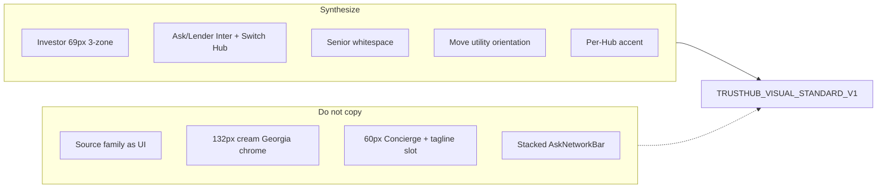
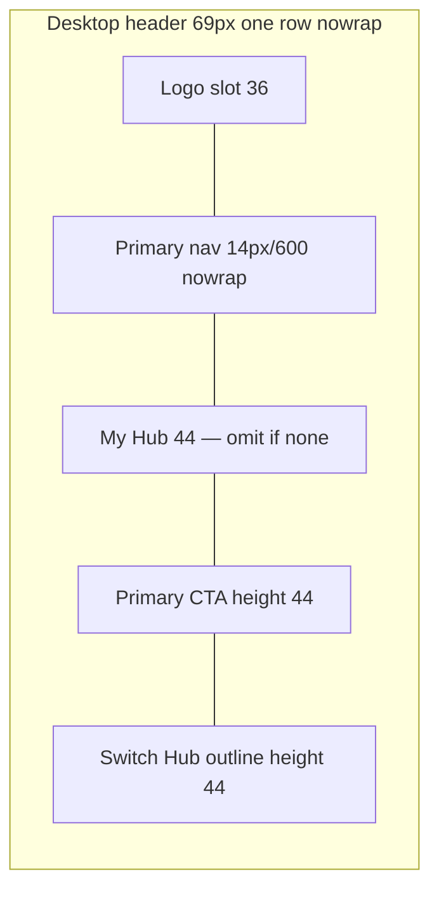
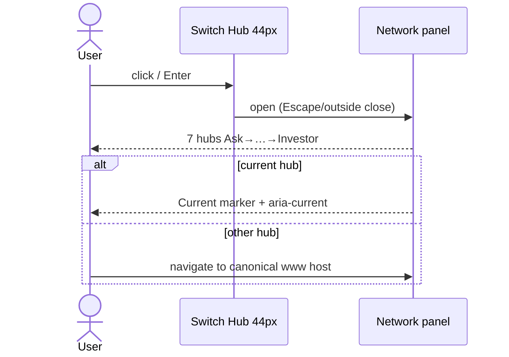

# TRUSTHUB_VISUAL_STANDARD_V1

**Document title:** TrustHub Network Visual System 1.0  
**Ticket:** VISUAL-001 — Network Visual System (design contract)  
**Author:** VISUAL-001 audit  
**Date:** 2026-08-21  
**Status:** READY FOR VISUAL-002  
**Production impact:** NONE — read-only audit + design contract. No production UI is changed in this ticket.  
**Worktree:** `ask-visual-001` branch `visual-001-network-design-contract` from SHA `08fe72dc`  
**Canonical parent:** https://www.asktrusthub.com  
**Network contract companion:** `docs/ASK-NETWORK-CONTRACT.md` (`2026.08.18-network-v2`)  
**Evidence:** Playwright captures 2026-08-21 at 1440×900 and 390×844 against canonical `www` hosts; `docs/artifacts/visual-001/measurements.json` (`capturedAt` `2026-08-21T18:13:51.176Z`); recapture screenshot `desktop/move-home.jpg` after Move skeleton.

This file is a **chassis contract**. Seven builders should implement the same shell. It does **not** copy Senior, Investor, Ask, or Lender wholesale. It synthesizes:

| Take from | What | Do not take |
|-----------|------|-------------|
| **Investor** | Compact 69px single-row header, 3-zone layout, outline Switch Hub, restrained card | Source Sans 3 / Source Serif 4 as network UI; cream as network canvas |
| **Ask / Lender** | Inter UI, outlined Switch Hub, registry order, current-Hub marker, navy footer | Ask’s 8-link nav, 60px Concierge, tagline-in-logo slot; Lender’s stacked `AskNetworkBar` + 36px header search |
| **Senior** | Whitespace discipline, quiet density, editorial breathing room | 132–148px chrome, 352×115 logo box, 86.4px Georgia hero, cream-as-network, text-only Switch Hub |
| **Move** | Utility-first orientation (tools before chrome), orange used as CTA not flood | Geist as network UI; 3-tier chrome (network bar + header + coach) as chassis |
| **Each Hub** | Distinct accent on CTA / active / focus only | Flooded accent layouts, rainbow nav pills |

Do not invent unpublished data. Do not change publication, ranking, or evidence logic. Visual language only.

---

## A. STATUS

**READY FOR VISUAL-002**

Evidence is sufficient to implement a reference chassis. Caveats (do not block VISUAL-002; they are first QA items):

1. **Move desktop home JSON is a loading skeleton — inner is valid.** Ignore `hubs.move.desktop.home` geometry (`header`/`logo`/`h1` all `0×0`). Use **`hubs.move.desktop.inner`**: logo **249×52 at `(35,63)`**, product `nav` 73px at y=57, main y=187, H1 52px/600 Geist. Mobile home is valid (logo 185×44 at `(15,63)`). Recapture screenshot `docs/artifacts/visual-001/desktop/move-home.jpg` is the visual source for the **home** utility hero. Inner logo `x=35` is the worst left-edge outlier (worse than Insurance/Lender 96).
2. **Logo method is re-export, not CSS crop.** Current CSS boxes are not ink. Published ink estimates: Ask ~46–48px in a 48px slot (tagline included); Senior ~85px in a 115px slot; Contractor ~30px in a 36px slot. VISUAL-002b re-exports tight-viewBox assets so **CSS slot height === ink**. The ink-scan harness is **VISUAL-002c**. Do not crop assets in VISUAL-001.
3. **Header PNG crops** exist for Ask, Contractor, Senior, Investor only. Move / Lender / Insurance are covered by home + switch-hub JPEGs plus Move inner measurements.
4. **`contentWidth` / `leftGutter` in JSON are viewport-level** (`main` is full-bleed). Real content edges are inferred from logo `x` (see §M).

Not BLOCKED. Dirty specialist worktrees were inspected only and not modified.

---

## B. REPOSITORY / VERCEL MAP

Inspect-only. Canonical hosts are `www`. Do not deploy from this ticket.

| Hub | GitHub | Local inspect | Public brand | Canonical host | Vercel project | SAFE TO INSPECT |
|-----|--------|---------------|--------------|----------------|----------------|-----------------|
| Ask | `savitz25/Conumers-Trust-Hub` | `ask-visual-001` (this WT); also `consumers-trust-hub` | Ask Trust Hub | https://www.asktrusthub.com | `conumers-trust-hub` `prj_925ZdSHjPhPU7pH9WiwyNOK1MrZB` | YES |
| Move | `savitz25/Move-trust-Hub` | Code tokens from `move-share-003`. `C:\Users\Michael.Savitsky\move-trust-hub` is **not** a valid git checkout — do not use. | Move Trust Hub | https://www.movetrusthub.com | `move-trust-hub` `prj_gudPGeW9SZBkgiL8zxvi3Swfo6T0` | YES production |
| Lender | `savitz25/Lender-Trust-Hub` | `lender-trust-hub` | Lender Trust Hub | https://www.lendertrusthub.com | `lender-trust-hub` `prj_Il28Mv0ebRiIrumFO7iBX6JrSbdD` | YES |
| Insurance | `savitz25/Insurance-trust-hub` | `insurance-trust-hub` | Insurance Trust Hub | https://www.insurancetrusthub.com | `insurance-trust-hub` `prj_ARBlfWYNhpJWBtaPO4vUJlraa5BK` | YES |
| Contractor | `savitz25/contractor-trust-hub` | Dirty NJ MyLicense WT — inspect only | Contractor Trust Hub | https://www.contractortrusthub.com | `contractor-trust-hub` `prj_OYmhfgBxZvRAKBPJv5zqshJnJwgq` | YES |
| Senior | `savitz25/care-trust-hub` | `care-trust-hub` — **do not rename Care repo** | SeniorTrustHub | https://www.seniortrusthub.com | `care-trust-hub` `prj_k9GyyXn28JZkyYKqLhBJ4rUQcpUb` | YES |
| Investor | `savitz25/investor-trust-hub` | `investor-trust-hub` | InvestorTrustHub | https://www.investortrusthub.com | Deploy **only** `investor-trust-hub-web` `prj_Qu2DT0AIy8R7XYTQiHgNcDYjE9i8` | YES |

**Typed hub IDs** (closed union, `lib/network/registry.ts`): `ask` · `move` · `lender` · `insurance` · `contractor` · `senior` · `investor`.

**Fonts as loaded in production layouts:**

| Hub | File | Face |
|-----|------|------|
| Ask | `ask-visual-001/app/layout.tsx` | `Inter` from `next/font/google`, variable **`--font-geist-sans`** (historical alias — the face is Inter, not Geist) |
| Move | `move-share-003/app/fonts.ts` | **Geist** (`--font-geist-sans`) + self-hosted `geist-latin-600.woff2` |
| Lender | `lender-trust-hub/app/layout.tsx` | Inter (`--font-inter`) |
| Insurance | `insurance-trust-hub/app/layout.tsx` | Inter (`--font-sans`) |
| Contractor | `contractor-trust-hub/app/layout.tsx` | **no webfont** — `ui-sans-serif, system-ui, Segoe UI` |
| Senior | `care-trust-hub/apps/web/src/app/globals.css` | Inter UI + **Georgia** display (`--font-serif`) |
| Investor | `investor-trust-hub/apps/web/src/app/layout.tsx` | **Source Sans 3** UI + **Source Serif 4** display |

---

## C. EXECUTIVE FINDING

The seven Hubs already share a **family resemblance** (navy `#0A2540` or near-navy ink, Inter-or-adjacent UI, `r=16` cards, outlined Switch Hub, “We cite. You decide.”) but they do **not** share a chassis. A consumer hopping Ask → Move → Lender → Insurance → Contractor → Senior → Investor currently experiences:

1. **Header height swing of 63px desktop** (Investor 69 vs Senior 132) and **83px mobile** (Ask 65 / Investor 69 vs Senior 148).
2. **Two chrome architectures.** Ask / Investor / Senior: single product header with Switch Hub inside. Move / Lender / Insurance / Contractor: stacked `AskNetworkBar` (~57–65px) **plus** product header, so combined chrome is 114–138px before any page content.
3. **Logo optical inequality.** CSS boxes range 36px (Contractor) → 48px (Ask/Lender/Insurance) → 115px (Senior). **Ink ≠ CSS:** Contractor ~30px ink in a 36px slot; Ask ~46–48px ink (3-line lockup fills 48px); Senior ~85px ink in a 115px slot. Investor uses a 40×40 mark + adjacent text, not a stacked PNG lockup.
4. **Content left-edge swing of 80px at 1440** (Insurance/Lender logo `x=96` vs Ask `x=176`).
5. **Four UI families** (Inter, Geist, Source Sans 3, Segoe UI) and two editorial serifs (Georgia, Source Serif 4).
6. **Control heights fail the 44px floor** in multiple headers (Contractor Switch Hub 36, Lender header search 36, Ask mobile sparkle 40, Ask desktop Concierge 60 overflowing a 73px bar).
7. **Switch Hub is not one component.** Ask/Lender/Insurance: outlined button + panel. Investor: `<details>` outline. Senior: text summary, no button chrome. Contractor: **two** Switch Hub controls (network bar + product bar). Move: network `Hubs ▾` **and** product `Switch Hub ▾`.

**Proposed chassis:** Investor’s compact **single-row 69px / 3-zone** structure, Ask/Lender **Inter + outlined Switch Hub + registry order**, Senior **whitespace (not height)**, Move **utility orientation**, each Hub’s **accent only on CTA / active / focus**. Network canvas `#F8FAFC`. Network UI font **Inter**. Specialist display serif **only** on Senior (Georgia) and Investor (Source Serif 4) editorial surfaces — never in chrome.



---

## D. CURRENT HUB MATRIX

Viewport: **1440×900 desktop / 390×844 mobile**, DPR 1, Playwright against `www`. Logo numbers are **CSS bounding boxes**, not optical ink. “Header height” is the measured `header` element when present; otherwise product `nav` + inferred network bar.

| Hub | Header height D / M | Logo CSS H×W D | Logo CSS H×W M | Logo x,y D | Container (inferred) | UI font | Display font | Nav size | Button height | Button radius | Card radius | Network bar | Switch Hub pattern | Overall deviation |
|-----|---------------------|----------------|----------------|------------|----------------------|---------|--------------|----------|---------------|---------------|-------------|-------------|--------------------|-------------------|
| **Ask** | 73 / 65 (`<header>`) | 48×240 at (176,12) | 48×160 at (20,8) | 176,12 | `max-w-6xl` 1152 + `lg:px-8` → edge 176 | Inter (`--font-geist-sans`) | Inter | 14px/600, 36px hits | Primary **60** (AI Concierge); Switch Hub 58; mobile sparkle 40 / menu 44 | 12 | 16 pad 16 | None (parent) | Outlined 12r, indigo hover | **Med** — Inter+outline OK; logo+tagline too tall; CTA 60; 8 nav items |
| **Move** | No `<header>`. **Home JSON D invalid (skeleton).** Inner D: product `nav` **73** at y=57 + ~57 network; main y=187. Mobile product `nav` 65 at y=57 + ~57 network = **~122** | **Inner 52×249 at (35,63)** (valid). Home JSON 0×0 **ignore**. Recapture home: stacked MOVE lockup | 44×185 at (15,63) | **35,63 (inner)** | Inner edge **35** (worst outlier). Mobile x=15 | **Geist** | Geist 52/600 H1 | Recapture: Find Movers / By State / Compare / Verify DOT | Recapture: orange Calculator pill + My Move + Switch Hub | Card 16 | 16 pad 28 D / 20 M | **Yes** ~57–65 `AskNetworkBar` | Product Switch Hub **and** network `Hubs ▾` | **High** — Geist, stacked chrome, utility hero is the right *orientation* |
| **Lender** | No `<header>`. Product `nav` 65 at y=57 (`h-14`/`h-16` in `Navbar.tsx`) + ~57 network = **~122**. Main y=122 | 48×200 at (96,65) | 40×144 at (16,65) | 96,65 | Wider than Ask; edge 96 | Inter | Inter 52/700 H1 | Source: Local Lenders, Compare rates, Calculators, Methodology, Trust | Header search **36**; Switch Hub present | 12 | 16 pad 24 | **Yes** `AskNetworkBar` y≈0–57 | Outlined (sibling of Ask) | **Med-High** — Inter OK; stacked bar; input 36; H1 700 |
| **Insurance** | No `<header>`. Product `nav` **81** at y=57 + ~57 network = **~138**. Main y=138 | 48×240 at (96,73) | 48×160 at (16,65) | 96,73 | Edge 96 | Inter | Inter 52/700 H1 | Source: Research, Marketplace, Medicare, Guides, Directory, Data, Methodology | Input **48** r=16 | 16 (controls too round) | 16 pad 24 | **Yes** `AskNetworkBar` | Outlined | **Med-High** — tallest stacked chrome among Inter hubs; control r=16 |
| **Contractor** | **114 / 110** combined `<header>` (includes network row) | **36×147** at (168,65) | 36×147 at (12,63) | 168,65 | Edge 168 | **Segoe UI / system-ui** | system-ui 48/600 | Explore, Plan, Verify, Tools, Guides | Switch Hub **36** r=12; Verify CTA 36 gold; mobile Menu 36 | 12 / 8 | 16 pad 20 | **Yes**, inside same `<header>` | **Dual** Switch Hub (bar + product); mobile 40h r=6 | **High** — no Inter; 36px targets; dual switcher; gold flood on one card |
| **Senior** | **132 / 148** tallest | **115×352** at (112,8) | **78×240** at (16,8) | 112,8 | `--content-width: 76rem` (1216) → edge 112 | Inter 18/17 body | **Georgia 86.4/500 D, 40/500 M** | Shortlist, Find care, Compare ~14.7px/750 | No button chrome; Switch Hub is `<summary>` text | — | **20** pad 24 | None | Text link, not outlined button; Current marker `rgba(104,24,96,0.08)` | **Highest** — do not copy; cream `#FCFAF6`, plum `#681860`, navy `#082860` |
| **Investor** | **69 / 69** most compact | **40×40 mark** at (168,14) + adjacent text (lockup 115×40) | 40×40 at (16,14) | 168,14 | `max-w-6xl` + `px-4 py-3 sm:px-6` → edge 168 | **Source Sans 3** | **Source Serif 4** 60/400 D, 36/400 M | 14px/400: Professionals Firms Research Tools Methodology Sources About | Open menu **44** r=8; Switch Hub `min-h-11` outline r=8 | 8 | 16 pad 24 | None | Outline `<details>`, current row `bg #F0FDFA` | **Low structure / High type** — take structure; replace Source with Inter for chrome |

**Accent colors captured 2026-08-21 (verify in QA; do not freeze from memory):**

| Hub | Production accent | Evidence |
|-----|-------------------|----------|
| Ask | Insight Indigo **`#4F46E5`** CTA (`rgb(79,70,229)`); hover Soft Purple **`#6B21A8`**; periwinkle **`#E0E7FF`**; teal/cyan **nodes in the PNG lockup** (asset, not a CSS token) | `ASK_BRAND`; measured Concierge fill; `globals.css` |
| Move | Orange **`#FF5A1F`** (`rgb(255,90,31)`); deep **`#E04410`** | Measured eyebrow; `move-share-003` `--move-orange` |
| Lender | Teal **`#0D9488`** (`rgb(13,148,136)`); forest hover **`#059669` / `#047857`** | Measured eyebrow; `LENDER_BRAND` |
| Insurance | Shield Blue **`#0284C7`** (`rgb(2,132,199)`); sapphire hover **`#1E3A8A`** | Measured eyebrow; `INSURANCE_BRAND` |
| Contractor | Gold/amber **`#F5C518`** (`rgb(245,197,24)`); navy type on gold | Measured Verify CTA + eyebrow; `contractor-trust-hub/app/globals.css --accent` |
| Senior | Plum **`#681860`** wordmark/current (`rgb(104,24,96)`); trust navy **`#082860`**; independence evergreen/jade **`#16473e` / `#3f8877`** | `brand.colors.primary`; `--color-senior-plum`; `--color-evergreen-*` |
| Investor | Teal **`#0F766E`**; deep **`#115E59`**; mist **`#F0FDFA`** (`rgb(240,253,250)` current row) | `--ith-teal` in `apps/web/src/app/globals.css` |

Shared navy used as footer/ink on Ask, Move, Lender, Insurance, Investor: **`#0A2540`**. Contractor uses the same navy for type. Senior footer measured `rgb(8,40,96)` = `#082860`.

---

## E. CURRENT DESKTOP HUB-HOP BOARD

Reference screenshots (all under `docs/artifacts/visual-001/`):

| Hub | Home crop | Full page | Inner | Switch Hub | Header crop |
|-----|-----------|-----------|-------|------------|-------------|
| Ask | `desktop/ask-home.jpg` | `desktop/ask-home-full.jpg` | `desktop/ask-inner.jpg` | `desktop/ask-switch-hub.jpg` | `headers/ask-desktop.png` |
| Move | `desktop/move-home.jpg` **(recapture — use this, not JSON D)** | `desktop/move-home-full.jpg` (may be skeleton-era; prefer recapture home) | `desktop/move-inner.jpg` | `desktop/move-switch-hub.jpg` | — |
| Lender | `desktop/lender-home.jpg` | `desktop/lender-home-full.jpg` | `desktop/lender-inner.jpg` | `desktop/lender-switch-hub.jpg` | — |
| Insurance | `desktop/insurance-home.jpg` | `desktop/insurance-home-full.jpg` | `desktop/insurance-inner.jpg` | `desktop/insurance-switch-hub.jpg` | — |
| Contractor | `desktop/contractor-home.jpg` | `desktop/contractor-home-full.jpg` | `desktop/contractor-inner.jpg` | `desktop/contractor-switch-hub.jpg` | `headers/contractor-desktop.png` |
| Senior | `desktop/senior-home.jpg` | `desktop/senior-home-full.jpg` | `desktop/senior-inner.jpg` | (open in navLinks geometry) | `headers/senior-desktop.png` |
| Investor | `desktop/investor-home.jpg` | `desktop/investor-home-full.jpg` | `desktop/investor-inner.jpg` | (panel in DOM at capture) | `headers/investor-desktop.png` |

**What a hub-hop currently feels like (desktop):**

1. Ask — white 73px bar, wide 240×48 lockup with tagline, indigo Concierge, outline Switch Hub, canvas `#F8FAFC`.
2. Move — **two bars** (Ask Trust Hub network + product), orange MOVE wordmark, utility route-planner hero, Geist.
3. Lender — two bars, teal eyebrow, Inter 52/700, logo starts 80px left of Ask.
4. Insurance — two bars, tallest Inter product nav (81px), Shield Blue, same 96px left edge as Lender.
5. Contractor — two rows in one 114px header, gold lockup CSS 36px (**~30px ink**), dual Switch Hub, Segoe UI, Verify gold CTA.
6. Senior — cream 132px, huge padded SVG, Georgia 86px H1, text Switch Hub, plum/navy lockup.
7. Investor — cream 69px, 40px mark + INVESTOR / TRUST HUB text, seven links, outline Switch Hub, Source families.

---

## F. CURRENT MOBILE HUB-HOP BOARD

| Hub | Home | Full | Nav open | Switch Hub | Header crop |
|-----|------|------|----------|------------|-------------|
| Ask | `mobile/ask-home.jpg` | `mobile/ask-home-full.jpg` | `mobile/ask-nav-open.jpg` | `mobile/ask-switch-hub.jpg` | `headers/ask-mobile.png` |
| Move | `mobile/move-home.jpg` | `mobile/move-home-full.jpg` | `mobile/move-nav-open.jpg` | `mobile/move-switch-hub.jpg` | — |
| Lender | `mobile/lender-home.jpg` | `mobile/lender-home-full.jpg` | `mobile/lender-nav-open.jpg` | `mobile/lender-switch-hub.jpg` | — |
| Insurance | `mobile/insurance-home.jpg` | `mobile/insurance-home-full.jpg` | `mobile/insurance-nav-open.jpg` | `mobile/insurance-switch-hub.jpg` | — |
| Contractor | `mobile/contractor-home.jpg` | `mobile/contractor-home-full.jpg` | `mobile/contractor-nav-open.jpg` | `mobile/contractor-switch-hub.jpg` | `headers/contractor-mobile.png` |
| Senior | `mobile/senior-home.jpg` | `mobile/senior-home-full.jpg` | (nav is always-visible row) | in-page panel | `headers/senior-mobile.png` |
| Investor | `mobile/investor-home.jpg` | `mobile/investor-home-full.jpg` | `mobile/investor-nav-open.jpg` | in drawer | `headers/investor-mobile.png` |

**Mobile chrome today:**

- Ask: `[Logo+tagline] [sparkle 40×40] [menu 44×44]` — Switch Hub **inside drawer** (this is the target pattern). Sparkle is 4px under the 44 floor.
- Move / Lender / Insurance: network bar (~57–65) **above** logo. Move logo at y=63.
- Contractor: network row + product row = 110px; mobile Switch Hub 40×120 in the **network** row; Menu 36px in product row; gold Verify 36px.
- Senior: 148px; logo 78px CSS; three text links wrapping under lockup (Shortlist / Find care / Compare at y=95).
- Investor: 69px; `[40px mark + wordmark] [Open menu 44×44 r=8]` — compact target.

---

## G. LOGO CONTRACT

### One method (mandatory)

**Re-export a tight-viewBox SVG (preferred) or PNG** so that **CSS `height` === optical ink**. There is no second method.

- Do **not** set `height: 36px` on a padded SVG/PNG and call it done (Senior failure mode).
- Do **not** crop, `object-position`-nudge, or CSS-mask production assets in lieu of a tight export.
- Do **not** crop or re-export in **this ticket** (VISUAL-001). VISUAL-002b ships the Ask tight asset; specialists follow in their visual PRs. VISUAL-002c is the **ink-scan harness** (luminance / non-transparent bbox vs CSS slot, ±1px).
- Tokens `--th-logo-slot-height-*` / `--th-logo-slot-width-*` are valid **only** on tight assets. Copy-pasting them onto today’s files will recreate the Senior bug.

After re-export:

```css
.th-logo-slot {
  box-sizing: border-box;
  height: var(--th-logo-slot-height); /* 36 / 33 / 30 */
  width: auto;
  max-width: var(--th-logo-slot-width);
  flex-shrink: 0;
}
.th-logo-slot img,
.th-logo-slot svg {
  display: block;
  height: 100%;
  width: auto;
  max-width: 100%;
  object-fit: contain;
  object-position: left center;
}
```

| Breakpoint | `--th-logo-slot-height` | `--th-logo-slot-width` (max) | Alignment |
|------------|-------------------------|------------------------------|-----------|
| Desktop ≥1024 | **36px** | **200px** | Left, content edge (§M) |
| Tablet 768–1023 | **33px** | **180px** | Left (mobile grammar, §H) |
| Mobile <768 | **30px** | **168px** | Left, 16px gutter |

Slot height is the **ink height**. Width hugs the lockup and must not exceed the max. Transparent background. No drop shadow. Taglines (`SOURCES. VERIFIED. YOU DECIDE.` / `control. connect. coordinate.`) are **personality**, not chassis — footer / Trust page only, never inside the header lockup.

### Current ink estimates (Ask / Senior / Contractor)

Not a luminance-harness scan (that is VISUAL-002c). Geometry-derived from production assets × measured CSS boxes. Builders must **not** invent other numbers.

| Hub | CSS box D | Source asset | Intrinsic / viewBox | How ink was estimated | **Current ink (display px)** |
|-----|-----------|--------------|---------------------|-----------------------|------------------------------|
| **Ask** | 48×240 | `public/brand/logo-header.png` (`BrandLogo` `headerSrc`; `.hub-logo-slot` `3rem` × `10–15rem`; HTML `height={65}` unused) | 719×243 PNG; alpha-tight (`ink_frac_h ≈ 1.0`) | 3-line composition (ASK + TRUST HUB + tagline) fills the bitmap. CSS 48px therefore shows **~48px of ink**, including the tagline. Wordmark+mark without tagline ≈ 2/3 of that stack. | **~46–48px** full lockup; **~36px** wordmark+mark excluding tagline |
| **Senior** | 115×352 | `apps/web/public/brand/senior-trust-hub-logo.svg` (`.brand-mark__logo` `width: clamp(16rem, 25vw, 22rem); height: auto`) | `viewBox="0 0 430 140"`; inner `<g transform="translate(8 8)">`; `SENIOR` `y=60` `/48`; `TRUST HUB` `y=112` `/42` | Ink y ≈ 12–116 of 140 (104/140). Display: `115 × (104/140) ≈ 85`. Compact sibling `viewBox="0 0 350 114"` is still padded — do not treat as tight. | **~85px** |
| **Contractor** | 36×147 | `public/brand/contractor-trust-hub-logo.svg` (`BrandLogo height={36}`) | `viewBox="0 0 900 220"`; `<g transform="translate(8, 10)">`; brackets `y=20…200` local | Ink y ≈ 30–210 of 220 (180/220). Display: `36 × (180/220) ≈ 29.5`. CSS 36 **is not** 36 ink. | **~30px** |

Ask and Senior are **too tall**. Contractor is **slightly short** of the 36px target once padding is removed — the tight re-export should land at **36px ink**, not stay at 30.

### Per-Hub asset table (target after re-export)

`object-position` is **`left center`** for every Hub. Do not implement these files in VISUAL-001.

| Hub | Current file | Current viewBox / intrinsic | Current CSS slot | Current ink (est.) | Target header file | Target viewBox | Target slot W×H | object-position |
|-----|--------------|-----------------------------|------------------|--------------------|--------------------|----------------|-----------------|-----------------|
| Ask | `/brand/logo-header.png` | 719×243 | 240×48 (slot 10–15rem × 3rem) | ~46–48 (w/ tagline) | `/brand/logo-header-tight.svg` (2-line, no tagline) | tight to mark + ASK / TRUST HUB | **200×36** D / 168×30 M | `left center` |
| Move | production lockup PNG/SVG (inner 249×52) | unknown pad; CSS 52 D inner / 44 M | 249×52 inner | treat 52 as box, not ink | tight SVG, orange MOVE + navy TRUST HUB | tight | **200×36** / 168×30 | `left center` |
| Lender | header PNG (`BrandLogo`) | CSS 200×48 D / 144×40 M | 200×48 | box 48; pad unknown | tight SVG | tight | **200×36** / 168×30 | `left center` |
| Insurance | header PNG | CSS 240×48 / 160×48 | 240×48 | box 48 | tight SVG | tight | **200×36** / 168×30 | `left center` |
| Contractor | `/brand/contractor-trust-hub-logo.svg` | `0 0 900 220` | 147×36 | **~30** | tight SVG (same gold/navy lockup) | tight to brackets + two-line type | **160×36** / 147×30 | `left center` |
| Senior | `/brand/senior-trust-hub-logo.svg` | `0 0 430 140` | 352×115 | **~85** | tight SVG (plum SENIOR + navy TRUST HUB) | tight to brackets + two-line type | **180×36** / 160×30 | `left center` |
| Investor | inline `BrandMark` 40×40 + `BrandWordmark` HTML | mark is the slot | 40×40 + text | **40** (mark) | keep HTML wordmark; mark SVG tight | mark viewBox tight | **mark 32×32** D / 30×30 M; wordmark Inter 13px/700 two-line | `left center` |

Investor is the **architecture** to copy (mark + HTML wordmark). Other Hubs may keep a single lockup SVG if the export is tight.

Shared network mark language: multi-node graph. Hub personality is the **frame + wordmark color**, not a unique illustration system in chrome.

---

## G2. CANONICAL TRUSTHUB MARK GEOMETRY (VISUAL-002 ADDENDUM)

**Ticket:** VISUAL-002 addendum — brand-mark geometry lock  
**Production impact:** NONE on Contractor (or any Hub) in this addendum. Documentation + simulation only. Contractor **must** re-export a corrected asset during its later visual migration — **do not** “fix” thickness with CSS scale, stroke overrides, transforms, or negative margins.

### CANONICAL TRUSTHUB MARK RULE

> **The bracket-and-four-point TrustHub mark is immutable network geometry. Hub identity changes through accent color and wordmark, not through bracket thickness, proportions, dot geometry or spacing.**

### Locked (must match across Hubs)

| Characteristic | Lock |
|----------------|------|
| Bracket stroke / shape thickness | Immutable |
| Bracket width-to-height proportions | Immutable |
| Bracket corner radius / cap treatment | Immutable |
| Bracket distance from center mark | Immutable |
| Four-point / dot size | Immutable |
| Four-point / dot spacing | Immutable |
| Center alignment | Immutable |
| Overall symbol bounding box | Immutable |
| Clear space between symbol and wordmark | Immutable |

### May vary

| Characteristic | Allowed |
|----------------|---------|
| Specialist bracket / accent color | Yes |
| Specialist wordmark text | Yes |
| Specialist wordmark color (where approved) | Yes |

The bracket geometry **must not** be independently redrawn per Hub.

### Canonical source

**Canonical geometry:** Ask / Move stroke-bracket family — specifically the reference SVG in `components/ask-network-mark.tsx` (`viewBox="0 0 36 36"`, bracket `strokeWidth="2.4"`, outer dots `r="2.5"`, center `r="2.1"`), which matches Move’s thinner stroke construction in `move-trust-hub-logo.svg` (`stroke-width="5.5"` on a ~84×60 mark field ≈ **6.5–6.7%** of mark height).

**Not canonical:** Contractor’s **filled** gold bracket paths (`contractor-trust-hub-mark.svg` / logo SVG), which read substantially heavier (~**16%** stem thickness vs bracket height, solid fill vs stroke). Prefer thinner Ask/Move geometry over Contractor unless a future asset audit proves otherwise — this audit does **not**.

Normalized ratios below use **% of mark height** so SVG viewBoxes of different sizes are comparable.

| Hub | Asset path | Format | Symbol / mark box | Bracket width (outer) | Bracket visual thickness | Dot diameter | Dot spacing (center→outer) | Transparent padding | Deviation from canonical |
|-----|------------|--------|-------------------|-----------------------|--------------------------|--------------|----------------------------|---------------------|--------------------------|
| **Ask (canonical)** | `ask-visual-002/components/ask-network-mark.tsx` (+ `public/brand/ask-bracket-hub-mark.png` raster companion) | SVG reference + PNG | `36×36` | outer x≈5–31 (**72%** of H) | **stroke 2.4** → **6.67%** of H | outer **13.9%** (`r=2.5`); center **11.7%** (`r=2.1`) | **21.7%** of H (centers at ±7.8) | none in SVG (tight) | **CANONICAL** |
| **Move** | `move-trust-hub-temp/public/brand/move-trust-hub-logo.svg` | SVG | mark ~`84×84` in `420×96` lockup | brackets x=8–76 | **stroke 5.5** → **~6.5%** of mark H | outer ~**10.7–13.1%** (`r=4.5–5.5`) | ~cross at 48 | modest pad in lockup | **MATCH** (stroke family) |
| **Lender** | `lender-trust-hub/public/brand/lender-trust-hub-logo-nav.png` (SVG wrappers embed PNG) | PNG (+ SVG `<image>`) | lockup 720×217; mark on left | raster stem ~18px mid-band | **~8%** of ink H (raster est.) | raster (four-point present) | raster | opaque plate risk on some exports | **NEAR MATCH** — prefer re-export as true stroke SVG from Ask/Move geometry |
| **Insurance** | Header lockup: `insurance-trust-hub/public/brand/insurance-trust-hub-logo-header.png`; favicon `insurance-trust-hub-icon.svg` | PNG lockup; SVG icon is **shield**, not brackets | header 720×198 | raster stem ~18px | **~9%** of ink H (raster est.) | present on lockup PNG | — | — | **LOCKUP NEAR MATCH**; **icon SVG is architecture outlier** (triangle shield ≠ bracket mark) |
| **Contractor** | `contractor-trust-hub/public/brand/contractor-trust-hub-mark.svg` (+ `contractor-trust-hub-logo.svg`) | SVG **filled** paths | mark `256×256`; logo `900×220` | outer x=32–224 | **fill stem ~32px / bracket H 200 → ~16%** | outer **r=14** (~11% of mark); center **r=18** | ±56 from center (~22% of mark) | `translate(8,10)` on logo | **TOO HEAVY** — filled brackets; **ASSET CORRECTION REQUIRED** at Contractor visual migration (no production change in VISUAL-002) |
| **Senior** | `care-trust-hub/apps/web/public/brand/senior-trust-hub-logo.svg` | SVG stroke | local symbol ~100×100 in `430×140` | stroke brackets H=100 | **stroke 8 → 8%** of symbol H | outer **r=8** (16% of symbol H) | ±35 from center | `translate(8 8)` | **MILD HEAVY** — stroke family but thicker/dotter than Ask/Move; re-export to canonical ratios at Senior migration |
| **Investor** | `investor-trust-hub/apps/web/public/brand/mark.svg` | SVG stroke | `512×512` | bracket H ~358 | **stroke 40.75 → ~11.4%** of bracket H (~8% of mark) | outer **r=38.31** (~15% of mark) | span ~249 on cross | none | **HEAVIER** than Ask/Move — re-export to canonical stroke % at Investor migration |

### Flags (migration backlog — not VISUAL-002 production edits)

| Hub | Flag |
|-----|------|
| **Contractor** | **YES — re-export** mark + lockup using Ask/Move stroke geometry; gold accent only. Do not CSS-fake thickness. |
| Senior | Re-export thinner stroke + smaller dots to canonical % |
| Investor | Re-export thinner bracket stroke to canonical % |
| Insurance | Replace shield-only favicon/icon with bracket mark; keep accent color for brackets |
| Lender | Prefer vector stroke SVG (stop PNG-in-SVG wrappers) from canonical geometry |
| Ask `public/brand/logo.svg` | Legacy hexagon “ConsumerTrustHub” tile — **not** network bracket; do not use as chrome mark |

### Simulation

`docs/artifacts/visual-002/hub-hop.html` must render **one** canonical bracket SVG (Ask/Move weight) recolored per Hub accent — not letter tiles or Hub-specific heavy brackets.

Evidence notes: SVG path/`stroke-width` inspected 2026-08-21+ addendum; Contractor fill vs Ask stroke is the primary inconsistency called out by product. Raster stem scans are supporting only (lockups include wordmark ink and can overestimate).

---

## H. HEADER CONTRACT

**One row. No stacked `AskNetworkBar`.** Network switching is Switch Hub only (`docs/ASK-NETWORK-CONTRACT.md` §5).

Two layouts only — **not three**:

| Viewport | Grammar | Height (border-box) |
|----------|---------|---------------------|
| **≥1024 (`lg`)** | Desktop 3-zone (§H zones) | **69px** |
| **<1024** (includes **768–1023 tablet**) | **Mobile grammar** (§Q): Logo \| My Hub (if any) \| Menu. Switch Hub **in the drawer** | **65px** tablet (768–1023); **57px** mobile (<768) |

Do not invent an `md` third chrome (Ask today shows Concierge + Switch Hub at `md:flex` and nav only at `lg`). Tablet uses the drawer, not a packed desktop row.

### Exact geometry

All chassis boxes are **`box-sizing: border-box`**. Header 69 = **68 content + 1px border**, not 69 + border.

| Token | Desktop ≥1024 | Tablet 768–1023 | Mobile <768 |
|-------|---------------|-----------------|-------------|
| Total header height (border box) | **69px** (`--th-header-height`) | **65px** (`--th-header-height-tablet`) | **57px** (`--th-header-height-mobile`) |
| Vertical padding | 12px around 44px controls (12+44+12+1=69) | 10px (10+44+10+1=65) | 6px (6+44+6+1=57) |
| Horizontal gutter | 24px inside 1200px shell | 24px | 16px |
| Sticky | `sticky top-0 z-50` | same | same |
| Surface | `var(--th-header-bg)` default `rgb(255 255 255 / 0.95)`. Senior/Investor **may** override to cream — same geometry | same | same |
| Bottom edge | 1px `var(--th-border)` only. No drop shadow on header | same | same |

Tolerance: height **±2px** (§W).

### Packing (desktop ≥1024)

The inner header is **one row**. Wrapping is how Senior already blows mobile to 148px — forbidden.

```
header inner {
  display: flex;
  flex-wrap: nowrap;
  align-items: center;
  height: var(--th-header-height); /* 69px border-box */
  overflow: visible; /* Switch Hub panel only; row itself does not wrap */
  gap: var(--th-nav-gap); /* 2px */
}
chrome controls (Primary, Switch Hub, My Hub, Menu, icon buttons) {
  box-sizing: border-box;
  height: 44px;          /* NOT min-height — Ask .ask-cta py-2.5 measured 60px in a 73px bar */
  flex-shrink: 0;
  white-space: nowrap;
  padding-block: 0;      /* vertical size comes from height, not py-* */
}
nav a {
  white-space: nowrap;
  flex-shrink: 0;
  height: 44px;
  display: inline-flex;
  align-items: center;
}
```

`overflow: visible` is only so the Switch Hub **panel** can escape. The flex row must not wrap, scroll, or stack.

**Ask parent overflow:** keep extra knowledge links as product, but **`Network`, `Standard`, and `Trust` are `hidden` below `xl` (1280)**. At `lg` (1024–1279) Ask shows `Ask · Path · My Journey · Journeys · Guides` + Primary + Switch Hub. Specialists must not copy the eight-link bar.

**My Hub is optional.** If the Hub has no shipped saved-work surface, **omit** the control — do not insert a dummy 44px hole. Investor has none today (`My InvestorTrustHub` is reserved). Senior Shortlist **is** a saved-work surface → keep as My Hub.

### Zones (desktop ≥1024)

```
|<-- 24px -->|[ LOGO slot 36 ]|-- gap 24 --|[ NAV nowrap 14/600 ]|-- min 16 --|[ My Hub? ] 8px [ Primary 44 ] 8px [ Switch Hub 44 ]|<-- 24px -->|
|                              1200px content box (at ≥1200; below that, 24px viewport gutters)                                           |
```



| Zone | Contents | Rules |
|------|----------|-------|
| **Logo** | Home link, slot 36×≤200 | Focus ring hub accent. `aria-label="{Hub} home"` |
| **Nav** | Hub product links only — **not** the seven-hub list | `hidden` below `lg`; `flex-nowrap`; 14px / 600 / navy; `--th-nav-gap: 2px`; active = accent color **or** 2px accent underline — not both a fill and a rainbow. Ask: hide Network/Standard/Trust below `xl`. |
| **My Hub** | `My Journey` / `My Move` / `My Lending` / `My Insurance` / Shortlist | Quiet; **`height: 44px`**. **Omit if no saved-work surface** (Investor). Not a second primary. |
| **Primary** | One hub CTA (AI Concierge, Calculator, Calculators, Research Center, Verify, …) | **`height: 44px`**, radius **12**, 600, accent **fill**, 8px icon gap. Not 60px. Not `min-height` + `py-2.5`. |
| **Switch Hub** | Identical network control (§O) | Outline, **`height: 44px`**, radius 12, 14px/600 navy, chevron 14px, 8px gap |

Ask’s “Knowledge & concierge” xl label is personality — `display:none` below `xl`, never increases header height, never wraps the row.

### Semantic markup

Prefer `<header>` (Ask/Investor/Senior/Contractor). Move/Lender/Insurance currently use `<nav>` as the bar — VISUAL-002+ wraps a real `<header>` so hub-hop QA can select one root.

---

## I. TYPOGRAPHY CONTRACT

### Network UI font

**Inter** for all chrome, buttons, forms, cards, nav, evidence chips, footer UI.

```css
--th-font-ui: Inter, ui-sans-serif, system-ui, -apple-system, "Segoe UI", sans-serif;
```

Ask already loads Inter aliased as `--font-geist-sans` — **keep the face, fix the alias** in VISUAL-002 (`--th-font-ui` / `--font-sans`). Do not load Geist for network chrome. Do not load Source Sans 3 for network chrome. Contractor must stop relying on Segoe UI.

`display: swap`. `adjustFontFallback: true`. System stack is the fallback so chrome is never webfont-blocked (§T).

### Specialist display (editorial only)

Allowed **only** on Senior and Investor **page titles / ledes / editorial H1–H2**, never on header, nav, buttons, or chips:

| Hub | Display face | Where |
|-----|--------------|-------|
| Senior | Georgia, "Times New Roman", serif | Hero H1, section H2 |
| Investor | Source Serif 4 | Hero H1, section H2 |
| All others | Inter (same as UI) | H1 included |

Move Geist may remain on **in-tool** route-planner internals during migration but is **not** the network standard. Target: Inter everywhere on Move chrome + marketing surfaces.

### Scale (exact)

| Role | Desktop | Mobile | Weight | Tracking | Color |
|------|---------|--------|--------|----------|-------|
| Eyebrow | 12px / 16lh | 11–12px | 600 | 0.14–0.16em | Hub accent |
| **H1 hero** | **48–56px** / 1.12lh | **30–36px** / 1.2lh | 600 (400–500 if serif display) | -0.02em | Navy `#0A2540` (Senior slate `#17201F` allowed) |
| H2 | 28–32px | 22–24px | 600 | tight | Navy |
| H3 | 20px | 18px | 600 | 0 | Navy |
| Body | **16px** / 24–28lh | 16px / 24lh | 400 | 0 | Ink `#1E293B` |
| Small / chip | 12–13px | 12px | 600 | 0 | Ink or navy — **never** light gray body |
| Nav / button | 14px / 20lh | 14px | **600** | 0 | Navy; active = accent |
| Caption / legal | 12px / 16–18lh | 12px | 400 | 0 | Ink (4.5:1) |

**Out of range today (must migrate):** Senior H1 86.4px; Investor H1 60px (serif 60 is the top of “48–60” — clamp to **56** if chassis H1 is Inter, allow 60 only as Investor serif exception with documented exception); Lender/Insurance H1 52px/700 → 48–56/**600**; Ask mobile H1 30px is in range.

Senior body 18px may stay as a **personality body** on long-form care pages (readability). Chrome stays 16/14.

---

## J. BUTTON CONTRACT

| Variant | Height | Radius | Weight | Fill | Border | Icon gap | Use |
|---------|--------|--------|--------|------|--------|----------|-----|
| **Primary** | **`height: 44px`** chrome / **`height: 48px`** hero (`box-sizing: border-box`; **not** `min-height`) | **12px** (`--th-radius-control`) | 600 | Hub `--th-accent` | none | **8px** | One per header; hero CTA |
| **Secondary** | 44 | **12** | 600 | White | 1px `--th-border` | 8px | Switch Hub, Compare, ghost tools |
| **Quiet** | 44 | **12** | 600 | Transparent | none | 8px | My Hub, text nav-as-button |
| **Icon** | **44×44** (`height`/`width`, not min) | **12** | — | Transparent or accent | optional 1px | — | Menu, Concierge sparkle, close |

**Foreground on fill:**

- Default: white on accent (Ask indigo, Move orange, Lender teal, Insurance blue, Investor teal, Senior plum).
- **Contractor gold `#F5C518`:** navy `#0A2540` on gold (white-on-gold fails WCAG). Measured production already does this.

**Forbidden:** 36px header buttons (Contractor/Lender); 60px Concierge; `min-height` + vertical padding instead of `height: 44px`; radius 8 on network Switch Hub (Investor r=8 → 12); radius 10 or 16 on controls (Ask nav `10px` and Insurance inputs `16px` both lose — **token 12 wins**).

Focus: 2px solid accent, 2px offset, never `outline: none` without replacement.

Ask `.ask-cta` (`globals.css`) is the primary **color** reference **after** height is set to `height: 44px; padding-block: 0; box-sizing: border-box` (today `py-2.5` + no height → measured **60px** in a 73px bar).

---

## K. FORM CONTROL CONTRACT

| Token | Value |
|-------|-------|
| Default height | **48px** (`height`, border-box; not `min-height` alone) |
| Radius | **12px** (`--th-radius-control`; not 16, not 10, not 0) |
| Border | 1px `#E2E8F0` |
| Text | 16px Inter (iOS zoom rule) |
| Padding | 12–16px; 40–48px left if leading icon |
| Focus | 2px accent ring / 40% alpha, border accent |

**Exceptions (keep specialized internals — do not restyle as marketing inputs):**

- Mortgage / insurance / move **calculators** (sliders, stepper matrices, amortization grids).
- Move route planner fields **inside** the plan card may stay visually embedded (no extra chrome) but **min-height 48** (today mobile 44 / radius 0).
- Lender **header search** must become 44–48, not 36 (`SearchBar` `[&_input]:h-9` in `Navbar.tsx`).

Insurance production input **48× r=16** — keep 48, set radius 12.

---

## L. CARD CONTRACT

| Token | Value |
|-------|-------|
| Radius | **16px** (`--th-radius-card`) |
| Border | **1px** `#E2E8F0` (Senior may use warm `#E6DECE` on cream paper) |
| Shadow | Restrained `--th-shadow-card`: `0 1px 2px rgb(10 37 64 / 0.05), 0 8px 24px rgb(10 37 64 / 0.07)` |
| Padding | **24px** desktop default; **16–20px** mobile |
| Fill | White |

Senior cards are **20px** radius today — migrate to 16 for chassis; keep cream canvas. Contractor’s gold-tinted first card (`rgba(245,197,24,0.18)`) is personality **if** it is one featured tile, not a layout flood.

No heavy `shadow-lg` on default cards (Ask concierge form currently `shadow-lg` — allow on the **single** hero intake card only).

---

## M. SPACING CONTRACT

### Scale (4–96)

```
4  8  12  16  20  24  32  40  48  64  80  96
```

CSS: `--th-space-1: 4px` … `--th-space-24: 96px` (×4). Prefer this over ad-hoc `px-2.5`.

### Shell

| Token | Value |
|-------|-------|
| Content width | **1200px** (`--th-content`) |
| Gutter | **24px** (`--th-gutter`); mobile 16px |
| Logo / H1 / card left edge | **Same x** across Hubs at a given viewport |

At **1440**: left content edge = `(1440 − 1200) / 2 + 24 = 144px`.

**Today (logo x at 1440) vs target 144:**

| Hub | Today x | Delta vs 144 |
|-----|---------|--------------|
| **Move inner D** | **35** | **−109** (worst outlier; `hubs.move.desktop.inner` logo at `(35,63)`) |
| Insurance / Lender | 96 | −48 (too wide / too little inset) |
| Senior | 112 | −32 |
| Investor / Contractor | 168 | +24 |
| Ask | 176 | +32 (`max-w-6xl` 1152 + 32px pad) |
| Move home D | invalid skeleton | use inner + recapture screenshot |
| Move M | 15 | target-ish for 390 (16) |

Ask `container-page`: `max-w-6xl px-5 sm:px-6 lg:px-8` → **change to 1200 + 24** in VISUAL-002. Investor `max-w-6xl … px-4 py-3 sm:px-6` → same shell, keep `py-3` math that yields 69px.

Senior `--content-width: 76rem` (1216) is close; align to 1200.

---

## N. NAVIGATION GRAMMAR

Primary nav stays **vertical / Hub-specific**. Labels may vary. Slot grammar is shared so hop-rhythm matches.

| Slot | Intent | Ask | Move | Lender | Insurance | Contractor | Senior | Investor |
|------|--------|-----|------|--------|-----------|------------|--------|----------|
| **Research / Find** | Start research | Ask, Path | Find Movers, By State | Local Lenders | Research, Directory | Explore, Verify | Find care | Professionals, Firms, Research |
| **Compare** | Side-by-side | — | Compare Movers | Compare rates | (tools) | — | Compare | (reserved `/compare`) |
| **Tools** | Calculators / utilities | — | Verify DOT | Calculators | Marketplace, Data | Tools, Plan | — | Tools |
| **Guides** | Editorial | Guides, Journeys | — | — | Guides | Guides | — | — |
| **Trust / Methodology** | Standard | Standard, Trust, Network | — | Methodology, Trust | Methodology | (Standards in network row — move to footer or Trust slot) | — | Methodology, Sources, About |
| **My [Hub]** | Saved work — **omit if none shipped** | My Journey | My Move | My Lending | My Insurance | omit unless a saved-work surface ships | Shortlist | **omit** (My InvestorTrustHub reserved, not shipped) |
| **Primary** | One accent CTA | AI Concierge | Calculator | Calculators | Research Center | Verify | — (optional Find care as primary) | — (optional Research) |
| **Switch Hub** | Network | yes | yes (dedupe vs Hubs ▾) | yes | yes | yes (**one**, not two) | yes (buttonize) | yes |

Parent Ask may keep extra knowledge links (Network, Standard, Trust) because that **is** its product, but they are **`hidden` below `xl`** so the 69px row cannot wrap at `lg`. Specialists must not copy Ask’s eight-link bar.

Do **not** put six industry pills in the header (`ASK-NETWORK-CONTRACT.md` §5).

---

## O. SWITCH HUB / NETWORK NAVIGATOR SPEC

**Identical component** on all seven Hubs. No second network bar. No rainbow pills.

### Trigger

```
[ Switch Hub ▾ ]  secondary button
box-sizing: border-box
height: 44px              /* not min-height */
flex-shrink: 0
white-space: nowrap
radius: 12px
border: 1px solid var(--th-border)
bg: #FFFFFF
color: #0A2540
font: Inter 14px/20px 600
icon: chevron 14px, 8px gap
hover: {
  border-color: color-mix(in srgb, var(--th-accent) 35%, var(--th-border));
  background: var(--th-accent-soft);
}
```

**<1024 (mobile + tablet):** **not in the bar**. Lives in the drawer (§Q). Drawer still uses this same menu list.

### Panel

- Width `min(100vw - 2rem, 18rem)`
- Radius 16, border 1px `#E2E8F0`, shadow `--th-shadow-card`
- Eyebrow: `Ask Trust Hub Network` 11px/600/0.12em, color = **current hub accent** (not always indigo)
- List order **fixed** (`NETWORK_HUB_IDS` / `switcherEntries()`):

```
1. Ask Trust Hub
2. Move Trust Hub
3. Lender Trust Hub
4. Insurance Trust Hub
5. Contractor Trust Hub
6. SeniorTrustHub
7. InvestorTrustHub
```

Blurbs from `NETWORK_REGISTRY[].switcherLabel` (do not rewrite claims):

| ID | Blurb |
|----|-------|
| ask | Parent research & standards layer |
| move | FMCSA / SAFER mover research |
| lender | NMLS / CFPB / FDIC financing research |
| insurance | State DOI / NAIC coverage research |
| contractor | State licensing-board contractor research |
| senior | CMS / supported state senior-care research |
| investor | SEC / IARD investment-firm research |

### Current-Hub marker

- `aria-current="page"`
- Visible **text** `Current` (11px/600 uppercase) — **not color alone**
- Soft accent wash (`--th-accent-soft`), 12px row radius, **`min-height: 44px`** (rows may grow for two-line blurbs; triggers stay `height: 44px`)
- No external-link icon on current; `ExternalLink` on others
- Footer of panel: `You are on {Hub} — {switcherLabel}.` with **live** `NETWORK_REGISTRY[current].name` and `.switcherLabel` — not the hardcoded Ask sentence in today’s `switch-hub-menu.tsx` (`You are on Ask Trust Hub — parent research & standards layer.`).

Escape closes. Click-outside closes. Focus trap in mobile sheet. `body` scroll lock while open (Investor/Lender already).

**Copy Ask interaction, not Ask marketing blurbs.** Take from `ask-visual-001/components/switch-hub-menu.tsx`: click-outside, Escape, `aria-current`, visible `Current` label, `switcherEntries()` **order**. Do **not** copy `ASK_NETWORK_LINKS[].blurb` — those rewrite claims (Move `FMCSA movers & local guides` vs registry `FMCSA / SAFER mover research`; Lender `NMLS-verified lenders` vs `NMLS / CFPB / FDIC financing research`; Insurance `Licensed agencies & plans` vs `State DOI / NAIC coverage research`). VISUAL-002b must delete the `ASK_NETWORK_LINKS.find` blurb fallback. Investor `min-h-11` becomes `height: 44px`. Senior `Current` copy stays.



---

## P. EVIDENCE COMPONENT LANGUAGE

**Visual-only. No new claims.** Chip **labels are the published `STANDARD_VOCABULARY` terms** in `ask-visual-001/lib/standard.ts`. Do not ship “Official Source”, “Research Available”, “Needs Review”, or a generic “Source” chip — those are not vocabulary terms. Do not implement chips in VISUAL-001.

### Alias table (chip label → vocabulary → meaning)

| Chip label (UI) | `STANDARD_VOCABULARY` term | Visual | Rule |
|-----------------|----------------------------|--------|------|
| **Verified** | Verified | Accent-soft fill, 12px/600, 9999px pill, optional check | Same meaning: matched key identity/authority fields to an attributable public source for that vertical; data lag applies. Not a performance promise. |
| **Primary source** | Primary source | Navy text, 1px border | **Not** “Official Source”. Regulator / official public registry that owns the record (FMCSA, state DOI, NMLS Consumer Access, …). |
| **Attributed review** | Attributed review | Border pill, ink | Review signal shown with its source platform. We do not invent testimonials or sell review placement. |
| **Independent** | Independent (research ordering) | Quiet 12px/600 pill | No paid placements in ranking order. Common ownership; research and listing order are not for sale. |

**Not chips (do not add vocabulary):**

| Tempting label | Disposition |
|----------------|-------------|
| Official Source | **Do not use.** Alias was wrong; the term is **Primary source**. |
| Source | **Do not use** as a chip. Use **Primary source** or **Attributed review** as applicable. |
| Research Available | **Do not ship.** Not in `STANDARD_VOCABULARY`. Presence of a research page is IA, not a claim chip. |
| Needs Review | **Do not ship.** Not in `STANDARD_VOCABULARY`. Incomplete match is vertical-specific UI, not a network badge. |
| Updated | **Caption**, not a chip: 12px timestamp of last successful source pull. No new term. |
| Trust Score / Reputation Score | **Do not introduce as a network-wide badge.** Vocabulary already says optional, vertical-specific, not for sale, not a single formula. |

Chips: height 24–28px, radius 9999px, padding 8×10, Inter 12px/600, 4.5:1 text. Hub evidence orientation remains `ASK-NETWORK-CONTRACT.md` §4 — this section does not change publication logic.

---

## Q. MOBILE SHELL CONTRACT

Applies to **all viewports <1024**, including tablet 768–1023 (one extra layout, not three). Heights: **57px** <768, **65px** 768–1023.

```
|<gutter>[ LOGO slot 30/33 ]|--------flex--------|[ My Hub 44×44 if any ][ Menu 44×44 ]|gutter>|
flex-nowrap; overflow visible only for menus
```

| Control | Spec |
|---------|------|
| Logo | Slot height 30 (mobile) / 33 (tablet); `object-position: left center` |
| My Hub | Icon or short label, **`height/width: 44px`**, quiet. **Omit if no saved-work surface.** |
| Menu | Hamburger, **44×44**, r=12, navy. Investor’s 44×44 r=8 → r=12 |
| Ask sparkle (Ask only) | If kept in the bar, **44×44** (today 40). Prefer drawer + header icon both 44. |
| Switch Hub | **Inside drawer**, full-width trigger + same panel list. Not a third icon in the bar. Not at `md`. |

Drawer: white, 16px padding, 16px/600 links **`height: 44px`**, primary CTA full-width `height: 48px`, then divider, then Switch Hub. Escape, overlay click, restore `body` overflow (Investor `SiteHeader` pattern).

Senior must **not** wrap three text links under a 78px logo. Collapse to this shell.

---

## R. SPECIALIST PERSONALITY RULES

What **MAY** change per Hub:

| May change | Examples |
|------------|----------|
| Logo lockup | Mark frame + wordmark color (orange MOVE, gold CONTRACTOR, plum SENIOR, indigo ASK) |
| Accent tokens | CTA fill, active nav, focus ring, eyebrow |
| Terminology | Verify DOT vs Verify vs Find care vs Firms |
| Tools | Calculators, route planner, Concierge, CMS filters |
| Editorial serif | Senior Georgia, Investor Source Serif 4 — **display only** |
| Illustrations / photography | Hero art, empty states |
| Paper tint | Senior cream `#FCFAF6`, Investor cream `#F6F4EF` as **page canvas**; chrome geometry still 69/57 |
| Body size | Senior long-form 17–18px |

What **MUST NOT** change:

- Header height, logo **slot** (CSS === ink on tight assets), content edge, Switch Hub component, Inter chrome, card 16, control `height: 44/48`, radius 12, accent-only (no flooded layouts), evidence chips (published terms only), footer ownership line, hub order.

**Color application rule:** accent on **CTA, active, focus, eyebrow, one hero control**. Not on backgrounds, not on every card border, not as a second header bar. Move’s peach hero wash and orange card top-rail are personality **if** limited to the home utility card. Contractor gold fill is for Verify CTA + mark — not page flood.

---

## S. ACCESSIBILITY STANDARD

WCAG **2.2 AA**.

| Rule | Spec |
|------|------|
| Touch / pointer targets | **44×44 CSS px** (`height`/`width`, not `min-height` with extra padding). WCAG 2.5.8 / 2.5.5 intent. Today’s 36px Contractor/Lender and 60px Ask Concierge fail. |
| Text contrast | **4.5:1** body and chrome text. Ink `#1E293B` on `#F8FAFC` / white passes. Do not use `--muted-foreground` light gray for body (Ask token comment already forbids this). |
| UI contrast | **3:1** for borders/icons that convey state. |
| Gold | Navy on `#F5C518`, never white on gold. |
| Focus | Visible 2px accent ring + offset. |
| Switch Hub current | Text “Current” + `aria-current` (not color alone). |
| Skip link | Investor/Senior have one; **all Hubs** get `Skip to content`. |
| Menu | Escape, focus return, no stuck scroll. |
| `prefers-reduced-motion` | No required motion in chassis. |

---

## T. PERFORMANCE STANDARD

| Rule | Spec |
|------|------|
| Chrome font | Inter `display: swap` + **system-ui fallback** so header paints in fallback metrics (`adjustFontFallback`) |
| No blocking webfont on chrome | Move’s preloaded `geist-latin-600.woff2` must not gate the network header after migration |
| Logo | SVG preferred; PNG budget **≤ 40KB** header asset. Tight viewBox so intrinsic ≈ display. Ask header PNG + tagline is a 48px 3-line lockup — **re-export** 2-line tight SVG; do not CSS-crop. |
| Sticky header | No layout shift: reserved `--th-header-height` on `header` |
| Images | `decoding=async`; LCP hero may `priority` — logo is not LCP on most Hubs |
| CSS | Tokens in `:root` / `[data-hub]`; no runtime fetch of network visual config (same rule as `ASK-NETWORK-CONTRACT.md`: specialists copy, they do not fetch) |

---

## U. TRUSTHUB_VISUAL_STANDARD_V1 TOKENS

Concrete CSS variables. Specialists override only `--th-accent*` and optional `--th-canvas` / `--th-header-bg` / `--th-font-display`. Chassis geometry tokens are not optional.

```css
:root,
[data-th-chassis] {
  box-sizing: border-box; /* 69 = 68 content + 1px border. Chassis boxes inherit. */

  /* Type */
  --th-font-ui: Inter, ui-sans-serif, system-ui, -apple-system, "Segoe UI", sans-serif;
  --th-font-display: var(--th-font-ui);

  /* Network surfaces */
  --th-navy: #0a2540;
  --th-ink: #1e293b;
  --th-canvas: #f8fafc;
  --th-paper: #ffffff;
  --th-header-bg: rgb(255 255 255 / 0.95);
  --th-border: #e2e8f0;
  --th-on-navy-muted: #94a3b8;
  --th-on-navy-soft: #cbd5e1;

  /* Accent — default parent; overridden per [data-hub] */
  --th-accent: #4f46e5;
  --th-accent-hover: #6b21a8;
  --th-accent-soft: #e0e7ff;
  --th-accent-foreground: #ffffff;
  --th-focus: var(--th-accent);

  /* Chassis */
  --th-header-height: 69px;
  --th-header-height-tablet: 65px;
  --th-header-height-mobile: 57px;
  --th-content: 1200px;
  --th-gutter: 24px;
  --th-gutter-mobile: 16px;
  /* Logo slots — VALID ONLY on tight-viewBox re-exports (CSS height === ink). See §G. */
  --th-logo-slot-height-desktop: 36px;
  --th-logo-slot-height-tablet: 33px;
  --th-logo-slot-height-mobile: 30px;
  --th-logo-slot-width-desktop: 200px;
  --th-logo-slot-width-tablet: 180px;
  --th-logo-slot-width-mobile: 168px;
  --th-control-height: 44px; /* use as height, not min-height */
  --th-hero-control-height: 48px;
  --th-control-icon-gap: 8px;
  --th-nav-size: 14px;
  --th-nav-weight: 600;
  --th-nav-gap: 2px; /* Ask gap-0.5; denser than Investor gap-1 so lg packing holds */

  /* Radius — freeze. Not a 10–12 range. */
  --th-radius-control: 12px;
  --th-radius-card: 16px;
  --th-radius-pill: 9999px;
  --th-radius-sm: 8px;

  /* Shadow / border */
  --th-shadow-soft: 0 1px 2px rgb(10 37 64 / 0.04), 0 4px 16px rgb(10 37 64 / 0.05);
  --th-shadow-card: 0 1px 2px rgb(10 37 64 / 0.05), 0 8px 24px rgb(10 37 64 / 0.07);
  --th-border-width: 1px;

  /* Space 4–96 */
  --th-space-1: 4px;
  --th-space-2: 8px;
  --th-space-3: 12px;
  --th-space-4: 16px;
  --th-space-5: 20px;
  --th-space-6: 24px;
  --th-space-8: 32px;
  --th-space-10: 40px;
  --th-space-12: 48px;
  --th-space-16: 64px;
  --th-space-20: 80px;
  --th-space-24: 96px;
}

[data-hub="ask"] {
  --th-accent: #4f46e5;
  --th-accent-hover: #6b21a8;
  --th-accent-soft: #e0e7ff;
  --th-accent-foreground: #ffffff;
}
[data-hub="move"] {
  --th-accent: #ff5a1f;
  --th-accent-hover: #e04410;
  --th-accent-soft: #fff4ef;
  --th-accent-foreground: #ffffff;
}
[data-hub="lender"] {
  --th-accent: #0d9488;
  --th-accent-hover: #047857;
  --th-accent-soft: #ccfbf1;
  --th-accent-foreground: #ffffff;
}
[data-hub="insurance"] {
  --th-accent: #0284c7;
  --th-accent-hover: #1e3a8a;
  --th-accent-soft: #e0f2fe;
  --th-accent-foreground: #ffffff;
}
[data-hub="contractor"] {
  --th-accent: #f5c518;
  --th-accent-hover: #e0b40f;
  --th-accent-soft: rgba(245, 197, 24, 0.18);
  --th-accent-foreground: #0a2540; /* navy on gold */
}
[data-hub="senior"] {
  --th-accent: #681860;
  --th-accent-hover: #4e1248;
  --th-accent-soft: rgba(104, 24, 96, 0.08);
  --th-accent-foreground: #ffffff;
  --th-canvas: #fcfaf6;
  --th-header-bg: rgb(252 250 246 / 0.95);
  --th-navy: #082860; /* personality navy; chassis geometry unchanged */
  --th-font-display: Georgia, "Times New Roman", serif;
  --th-independence: #16473e; /* evergreen — independence signals, not chrome flood */
}
[data-hub="investor"] {
  --th-accent: #0f766e;
  --th-accent-hover: #115e59;
  --th-accent-soft: #f0fdfa;
  --th-accent-foreground: #ffffff;
  --th-canvas: #f6f4ef;
  --th-header-bg: rgb(246 244 239 / 0.92);
  --th-font-display: "Source Serif 4", Georgia, serif;
  /* UI remains Inter — do not set --th-font-ui to Source Sans 3 */
}
```

Ask `app/layout.tsx` already sets `data-hub="ask"` and `data-network-standard`. VISUAL-002 adds `data-th-chassis="v1"` and `*, *::before, *::after { box-sizing: border-box }` on the chassis root if Tailwind preflight is not guaranteed (Senior already sets it globally; Ask relies on preflight).

`--th-logo-slot-height-*` must **not** be applied to current padded assets. Gate: VISUAL-002c ink-scan must pass ±1px against the slot before specialists copy the tokens onto production logos.

---

## V. FUTURE TARGET MOCKUP

Do **not** implement in VISUAL-001. Target hop: same chassis, different accent + lockup + labels.

### Desktop wireframe

```
┌────────────────────────────────────────────── 1440 ──────────────────────────────────────────┐
│ sticky header 69px  --th-header-bg  border-b  flex-nowrap  one row                           │
│  144 │ LOGO 36×≤200 │ Find  Compare  Tools  Guides  Trust │ [My?] [Primary 44] [Switch Hub 44] │ 144 │
│      │              │ 14/600 nowrap  gap 2px              │ height 44 not min-height           │     │
├──────────────────────────────────────────────────────────────────────────────────────────────┤
│ canvas #F8FAFC (or cream if Senior/Investor)                                                 │
│   144 │ H1 48–56 / 600  (serif only Senior/Investor)                                    144 │
│       │ body 16                                                                          │
│       │ [ Hero primary 48 ] [ secondary 48 outline ]                                     │
│       │ ┌ card r=16 pad=24 border 1px ──────────────────────────────────────────────┐    │
│       │ │ utility / research module                                                │    │
│       │ └──────────────────────────────────────────────────────────────────────────┘    │
│       │ chips: Verified · Primary source · Attributed review   caption: Updated          │
└──────────────────────────────────────────────────────────────────────────────────────────────┘
```

Nav items are **one line**. The ASCII above is columns, not wrapped header rows.

### Mobile / tablet wireframe (<1024)

```
┌──────── 390 (57px) / tablet (65px) ────────┐
│ [Logo 30/33]          [My if any 44][≡ 44] │
├────────────────────────────────────────────┤
│ H1 30–36                                   │
│ [Primary 48]                               │
│ card r=16 pad 16–20                        │
└────────────────────────────────────────────┘
     ≡ drawer
  nav links height 44
  Primary 48
  ─────────
  Switch Hub (same panel)
```

```mermaid
flowchart TB
  subgraph desk [Desktop chassis ≥1024]
    H[Header 69px nowrap: Logo | Nav | My Hub? + Primary 44 + Switch Hub 44]
    M[Main: H1 48-56 + utility/research]
    F[Footer navy related-not-identical]
  end
  subgraph mob [lt 1024 chassis]
    H2[Header 57/65: Logo | My Hub? | Menu]
    D[Drawer contains Switch Hub]
  end
  H --> M --> F
  H2 --> D
```

Move keeps the **route planner as the homepage product**, not a marketing poster. Ask keeps Concierge as primary. Senior keeps editorial serif H1 **inside 48–56** (down from 86.4). Investor keeps serif H1 **inside 48–56** (60 → 56 unless exception logged).

---

## W. HUB-HOP QA CONTRACT

Playwright, 1440×900 and 390×844, canonical `www` hosts. Compare seven Hubs in one board.

| Check | Tolerance | Notes |
|-------|-----------|-------|
| Logo **slot vs ink** | **±1px** vs `--th-logo-slot-height-*` | VISUAL-002c ink-scan on **tight** assets. Fail if CSS height ≠ ink. Do not scan padded current files as a pass. |
| Header height | **±2px** vs 69 / **65 tablet** / 57 | Combined chrome — **no** extra network bar. Fail if row wraps (height > token + 2). |
| Header packing | nowrap; control `height` 44 | Fail `min-height`-only controls that compute >44 |
| Content left edge | **±2px** vs shell formula | Logo x === H1 x === card x. Move inner x=35 is a known fail until migrated. |
| Switch Hub | **Identical** trigger + order + Current marker | Screenshot diff of panel. Blurbs = `switcherLabel` only. |
| Control height | **44px** chrome / 48 hero | Fail if 36 or 60 |
| UI font | Inter computed on `header` | Fail Geist / Source Sans / Segoe on chrome |
| Accent usage | CTA/active/focus only | Heuristic: accent fill area < 8% of first viewport excluding one hero CTA |

Move desktop **home** must be recaptured after load (wait for `h1`, not skeleton). Inner `/companies/1-800-pack-rat` is already valid in `measurements.json`.

---

## X. MIGRATION RANKING

Impact = consumer-visible hop delta. Effort = engineering. Risk = brand / a11y / layout breakage.

| Hub | Impact | Effort | Risk | Priority | Why |
|-----|--------|--------|------|----------|-----|
| **Ask** | Med | Med | Low | **P0 — chassis host** | Parent; Inter already; Switch Hub exists; tokens live in `lib/design/ask-design-system.ts` + `globals.css`. Shrink Concierge, logo slot, container 1200. |
| **Investor** | Low structure / Med type | Med | Med | **P1** | Geometry already 69px. Swap chrome to Inter; keep Source Serif display; shrink 40px mark; buttonize already-outline Switch Hub to 12r. |
| **Lender** | High | Med | Med | **P1** | Drop `AskNetworkBar`; Inter stays; fix 36px search; edge 96→144; H1 700→600. |
| **Insurance** | High | Med | Med | **P1** | Same stacked-bar removal; nav 81→68; input r 16→12. |
| **Move** | High | High | Med | **P2** | Drop network bar + `Hubs ▾` duplicate; Geist→Inter chrome; keep orange utility hero. Recapture harness first. |
| **Contractor** | High | Med | Med | **P2** | Add Inter; kill dual Switch Hub; lift 36→44; gold navy-on-fill; **re-export tight logo** (~30px ink → 36px slot). Dirty WT — isolate PRs. |
| **Senior** | Highest visual | High | **High** | **P3** | Re-export tight SVG (~85px ink → 36px slot), 132→69 header, H1 86→48–56 Georgia, buttonize Switch Hub, card 20→16. Preserve plum/cream/independence teal. Easy to look “not Senior” if over-normalized. |

---

## Y. VISUAL-002 PLAN

**Do not execute in VISUAL-001.**

**Chassis host: Ask** (`savitz25/Conumers-Trust-Hub` / `ask-visual-001`), not Investor.

Reasons:

1. Ask is the parent of `ASK-NETWORK-CONTRACT.md` and `NETWORK_REGISTRY`.
2. Inter is already the production face (despite `--font-geist-sans` alias).
3. `SwitchHubMenu` is the closest complete component (`components/switch-hub-menu.tsx`).
4. This worktree is where the contract lands.
5. Investor compactness is the **measurement target**, but Source Sans 3 must not become the network UI font. Hosting on Investor would ship the wrong face as “default.”

**VISUAL-002 scope (Ask only):**

1. Token package `--th-*` in `app/globals.css` + `lib/design/trusthub-visual-standard.ts` (including `--th-logo-slot-height-*`, `--th-header-height-tablet`, `--th-header-bg`, `--th-nav-gap`, `box-sizing: border-box`).
2. Header 69px, one-row `flex-nowrap`, `height: 44px` Concierge + Switch Hub (not `min-height`), hide Network/Standard/Trust below `xl`.
3. **Re-export** Ask tight header lockup (no tagline) so 36px CSS === 36px ink. Do not CSS-crop the current PNG.
4. Shell `1200 + 24`. Mobile/tablet grammar `<1024` with Switch Hub in drawer.
5. Switch Hub: Ask **interaction** only; blurbs from `NETWORK_REGISTRY.switcherLabel`; live footer line.
6. No specialist production deploys. No evidence-chip implementation in 002 unless Ask already shows vocabulary terms.

Then PRs in §PR Plan.

---

## Color application rules

Accent is a **signal**, not a theme wash.

- **Do:** primary CTA fill, active nav, `:focus-visible` ring, eyebrow, one hero button, Switch Hub hover border.
- **Do not:** full-width accent headers, every card border in accent, rainbow hub pills, accent body text, gold/orange page backgrounds.
- Contractor gold and Move orange are high-chroma — extra restraint.
- Senior plum on wordmark + teal/evergreen on **independence statements** only (`.independence-statement`), not both as competing CTAs.
- Investor teal mist (`#F0FDFA`) is for current-hub row and selected chips, not page flood.

---

## Radius / shadow / border token set

| Token | Value | Applies to |
|-------|-------|------------|
| `--th-radius-control` | 12px | Buttons, inputs, Switch Hub, icon buttons |
| `--th-radius-card` | 16px | Cards, Switch Hub panel, forms |
| `--th-radius-pill` | 9999px | Evidence chips, current-hub badge |
| `--th-radius-sm` | 8px | Tooltips, tiny inner chips only |
| `--th-border-width` | 1px | Header, cards, secondary buttons |
| `--th-border` | `#E2E8F0` | Cool network; Senior warm `#E6DECE` on cream cards only |
| `--th-shadow-soft` | see §U | Coach banners, lifts |
| `--th-shadow-card` | see §U | Default cards — no second shadow system |

---

## Footer related-not-identical

Footers **rhyme**; they are not pixel-identical.

| Shared | Variable |
|--------|----------|
| Navy field `#0A2540` (Senior may use `#082860`) | Hub name, column 1 IA |
| Ownership line: `Common ownership · Separated research and listing order · No paid placements` | Accent on current-hub name only |
| Network links in registry order; **omit self-link** (`ASK-NETWORK-CONTRACT.md` §5) | Tool / directory links |
| Standard URL `https://www.asktrusthub.com/methodology` | Legal set (Investor disclaimer, etc.) |
| Inter 14/16, 24px gutter, 1200 shell | Illustrations |
| Logo optical ≤ 36, inverted/light asset | |

Contractor’s white footer (`bg-[var(--bg-elevated)]`) should join navy family so hops do not flash white→navy. Personality: gold hairline or gold mark on navy, not a unique footer architecture.

---

## Alternatives considered

### 1. Copy Senior wholesale

**Pros:** Distinctive, calm, high-trust editorial, existing independence language.  
**Cons:** 132–148px chrome, padded SVG, Georgia 86px, cream as network default, text Switch Hub, body 18px — specialists become a care magazine. **Rejected** for chassis. Keep whitespace + plum/Georgia as Senior personality only.

### 2. Copy Investor wholesale (including Source family)

**Pros:** Best compact geometry (69px both breakpoints), clean 3-zone, outline Switch Hub, serif display already separated from UI.  
**Cons:** Source Sans 3 / Source Serif 4 as network UI would force six Hubs off Inter; cream canvas; 40px mark; r=8 controls. **Rejected as a clone.** **Accepted as structure.**

### 3. Per-Hub design systems with no chassis

**Pros:** Zero migration; each `*-design-system.ts` stays sovereign.  
**Cons:** Current state. 80px edge drift, 63px header drift, four UI fonts, dual Switch Hubs, stacked network bars. Hub-hop fails the “one network” claim in `ASK-NETWORK-CONTRACT.md`. **Rejected.**

### 4. Keep `AskNetworkBar` + compact product header (not chosen)

**Pros:** Move/Lender/Insurance/Contractor already shipped it; current-hub chip is explicit.  
**Cons:** Adds ~57px forever; duplicates Switch Hub; Ask/Senior/Investor never had it — hop still breaks. Contract §5 already says switching is secondary chrome **Switch Hub ▾**, not a second bar. **Rejected.**

---

## Production impact

**NONE for VISUAL-001.** No production UI, tokens, or copy is shipped. Dirty worktrees (Contractor NJ MyLicense, others) were not modified. This document is the contract for VISUAL-002+.

---

## Open Questions

1. Ask header tagline (`SOURCES. VERIFIED. YOU DECIDE.` / `control. connect. coordinate.`): footer-only vs `xl` text beside logo? **Recommendation:** footer + Trust page; not in 36px lockup.
2. Investor H1 60px serif: allow as display exception (top of 48–60) or clamp 56? **Recommendation:** allow 56–60 serif on Investor/Senior only; Inter H1 caps at 56.
3. Senior body 18px: keep on article templates? **Recommendation:** yes, personality; chrome 16.
4. Move Geist inside the route planner widget only? **Recommendation:** Inter on VISUAL-004 Move chrome; planner internals can lag one PR.
5. Shared package vs copied tokens? Network V2 forbids runtime fetch. **Recommendation:** copied `trusthub-visual-standard.ts` + CSS block per repo, version `2026.08.21-visual-v1`, same as registry copy rule.
6. Should Ask primary remain “AI Concierge” in the 44px slot? **Yes** — personality CTA; only the **size** is chassis.

---

## Risks

| ID | Severity | Risk | Mitigation |
|----|----------|------|------------|
| R1 | **High** | Senior “feels generic” after 132→69 and 86→56 | Personality rules §R; Georgia display; cream canvas; plum wordmark; evergreen independence; P3 last |
| R2 | **High** | Removing `AskNetworkBar` looks like a missing control on Move/Lender/Insurance/Contractor | Identical Switch Hub with Current marker; QA screenshot of panel; changelog “Network bar merged into Switch Hub” |
| R3 | **Med** | Ask tight re-export drops recognized tagline | Move tagline to footer/Trust; keep multi-node mark; do not CSS-crop the current PNG |
| R4 | **Med** | Inter vs Geist CLS on Move | `display:swap` + fallback metrics; do not block on webfont |
| R5 | **Med** | Contractor gold contrast if someone uses white type | Token `--th-accent-foreground: #0A2540`; lint |
| R6 | **Low** | Token drift across seven repos | Version stamp `data-th-chassis="v1"` + hub-hop QA |
| R7 | **Low** | Optical QA flaky on antialiased PNG | Tolerance ±1px; fixture SVGs preferred |

---

## References

- `docs/ASK-NETWORK-CONTRACT.md` — Network V2 (`2026.08.18-network-v2`)
- `lib/network/registry.ts` — hub IDs, origins, switcher blurbs
- `lib/design/ask-design-system.ts` — Ask tokens, `ASK_HEADER_NAV`, `ASK_NETWORK_LINKS`
- `ask-visual-001/components/navbar.tsx`, `switch-hub-menu.tsx`, `brand-logo.tsx`
- `ask-visual-001/app/globals.css` — `.hub-logo-slot`, `.ask-cta`
- `lender-trust-hub/lib/design/lender-design-system.ts`, `components/network/ask-network-bar.tsx`, `components/Navbar.tsx`
- `insurance-trust-hub/lib/design/insurance-design-system.ts`
- `move-share-003/app/fonts.ts`, `app/globals.css` (`#FF5A1F`)
- `contractor-trust-hub/app/globals.css` (`--accent: #f5c518`)
- `care-trust-hub/apps/web/src/config/brand.ts`, `packages/ui/src/index.tsx` `Header`, `apps/web/src/app/globals.css`
- `investor-trust-hub/apps/web/src/app/layout.tsx`, `apps/web/src/components/site-header.tsx`, `packages/config/src/brand.ts`
- Evidence: `docs/artifacts/visual-001/measurements.json`, `summarize.py`, `capture.mjs`, `recapture-move.mjs`
- `lib/standard.ts` `STANDARD_VOCABULARY`

---

## Key Decisions

1. **Chassis, not a clone.** Investor structure + Ask/Lender network conventions + Senior whitespace + Move utility orientation + distinct accents.
2. **Network UI font is Inter.** Specialist display serif only Senior (Georgia) and Investor (Source Serif 4). Geist and Source Sans 3 are not network chrome. Ask’s `--font-geist-sans` alias is historical and will be renamed in VISUAL-002.
3. **Single header, two grammars:** 69px ≥1024 (nowrap desktop zones); **<1024 = mobile grammar** at 65px tablet / 57px mobile. Stacked `AskNetworkBar` is not chassis. Switch Hub is the only network navigator. Ask hides Network/Standard/Trust below `xl`. Omit My Hub if no saved-work surface.
4. **Logo method is re-export tight-viewBox so CSS slot height === ink** (36 / 33 / 30). Current estimates: Ask ~46–48, Senior ~85, Contractor ~30. No CSS crop/mask. Ink-scan is VISUAL-002c.
5. **Controls `height: 44px` / hero 48 / radius 12 frozen / weight 600 / icon gap 8.** Not `min-height`. Accent fill only. Gold uses navy foreground.
6. **Forms 48px default.** Calculators keep specialized internals.
7. **Cards 16 / 1px / restrained shadow / 24 pad.**
8. **Shell 1200 + 24.** Shared left edge ±2px.
9. **Switch Hub is one component**, order Ask→Move→Lender→Insurance→Contractor→Senior→Investor, Current marker not color-only.
10. **Evidence chips use `STANDARD_VOCABULARY` labels** (Verified, Primary source, Attributed review, Independent). No “Official Source” / “Needs Review” / “Research Available.”
11. **VISUAL-002 host is Ask**, using Investor measurements as the numeric target.
12. **Production impact of VISUAL-001 is none.**

---

## PR Plan

Ordered. Later Hubs depend on Ask tokens + QA harness. Do not implement here.

| # | Title | Files / components | Depends on | Description |
|---|-------|-------------------|------------|-------------|
| **1** | **VISUAL-002a — Ask tokens package** | `app/globals.css`, new `lib/design/trusthub-visual-standard.ts`, `app/layout.tsx` (`data-th-chassis`), rename `--font-geist-sans` usage toward `--th-font-ui` without dropping Inter | This contract | Land `--th-*` variables, hub accent maps, radius/shadow/space. No layout change yet if needed to split review — prefer same PR if small. |
| **2** | **VISUAL-002b — Ask shell + tight logo re-export** | `components/navbar.tsx`, `components/switch-hub-menu.tsx`, `components/brand-logo.tsx`, `.hub-logo-slot`, `components/footer.tsx`, **new** `/brand/logo-header-tight.svg` (do not CSS-crop `logo-header.png`) | PR 1 | 69px nowrap header; `height: 44px` Concierge + Switch Hub; hide Network/Standard/Trust below `xl`; 36×200 slot on **tight** asset; 1200+24; `<1024` drawer Switch Hub; skip link; registry blurbs only. |
| **3** | **VISUAL-002c — Hub-hop + ink-scan harness** | `docs/artifacts/visual-001/capture.mjs` (wait for `h1`; ignore `move.desktop.home` skeleton; keep `move.desktop.inner`), luminance/alpha ink-scan vs `--th-logo-slot-height-*`, Playwright board | PR 2 | Tolerances §W including wrap detection and `height: 44` vs computed 60. Does not fail specialists until they migrate. |
| **4** | **VISUAL-003 — Investor chrome → chassis** | `apps/web/src/components/site-header.tsx`, `apps/web/src/app/layout.tsx`, `apps/web/src/app/globals.css` | PR 1–2 | Keep 69px and cream; Inter UI; Source Serif display; mark 32–34; Switch Hub r=12 identical panel; deploy `investor-trust-hub-web` only. |
| **5** | **VISUAL-003b — Lender drop network bar** | `app/layout.tsx`, `components/network/ask-network-bar.tsx` (remove from chrome), `components/Navbar.tsx`, `components/switch-hub-menu.tsx`, `app/globals.css` | PR 1–2 | Inter stays; 36→48 search; shell 1200; one Switch Hub. |
| **6** | **VISUAL-003c — Insurance drop network bar** | `app/layout.tsx`, `components/navbar.tsx`, network bar, tokens | PR 5 pattern | Nav 81→69; input r=12; Shield Blue accent preserved. |
| **7** | **VISUAL-004 — Move chrome** | `move-share-003` / production Move repo (not invalid local checkout), header, fonts.ts, `AskNetworkBar` | PR 3 recapture | Inter chrome; one Switch Hub; keep `#FF5A1F` utility hero; planner min-height 48. |
| **8** | **VISUAL-004b — Contractor Inter + one Switch Hub** | `app/layout.tsx`, `app/globals.css`, `components/layout/SiteHeader.tsx`, tight logo SVG | PR 2 | Isolated from dirty NJ WT; 36→44 controls; gold navy-on-fill; re-export lockup so 36 CSS === 36 ink (today ~30). |
| **9** | **VISUAL-005 — Senior tight logo + compact header** | `packages/ui` `Header`, `apps/web/src/app/globals.css`, **re-export** `/brand/senior-trust-hub-logo.svg` tight viewBox | PR 2, last | 69/57 chassis; 36×180 slot on tight SVG (today ~85 ink in 115 box); Georgia H1 48–56; Switch Hub buttonized; cream/plum/evergreen personality retained. |
| **10** | **VISUAL-006 — Hub-hop gate** | CI Playwright on all seven `www` (or preview) | PRs 4–9 | Fail merge if §W tolerances break. |

Each specialist PR copies tokens (no runtime fetch). Footer related-not-identical rides along with shell PRs, not as a separate aesthetic rewrite.

---

*End of TRUSTHUB_VISUAL_STANDARD_V1. Status: READY FOR VISUAL-002. Production UI unchanged.*
